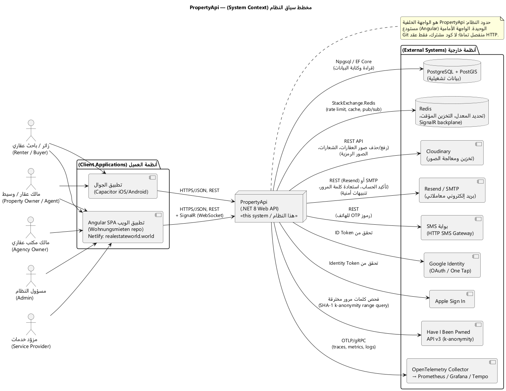
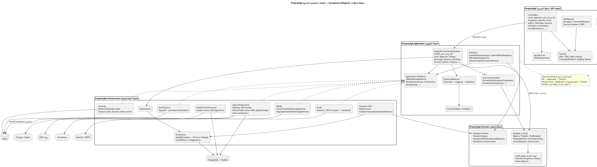
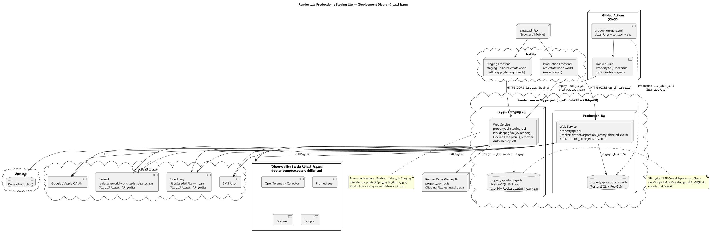
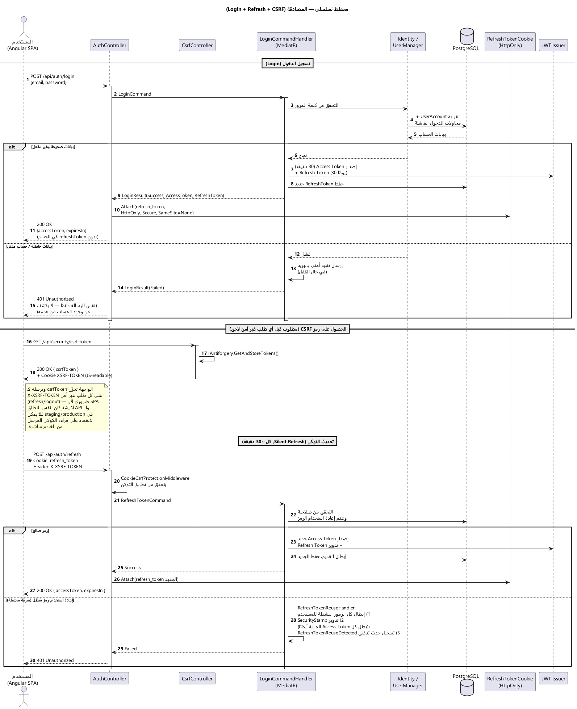
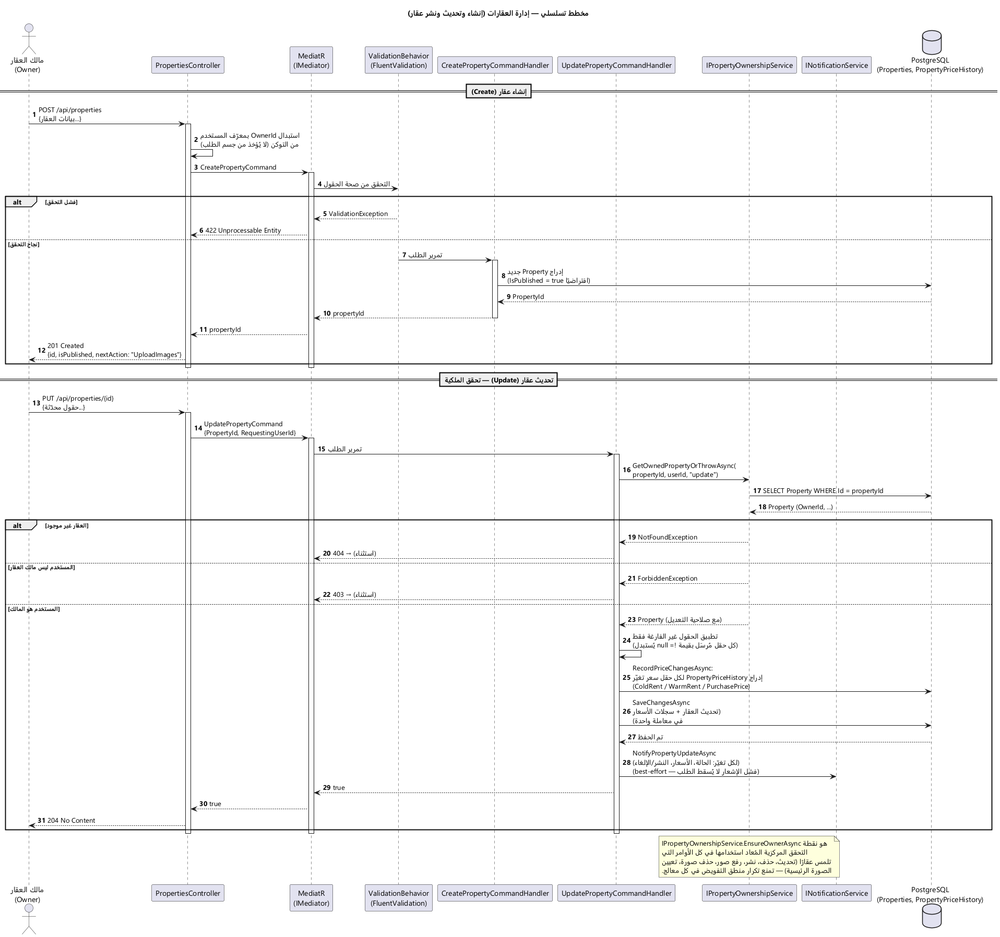
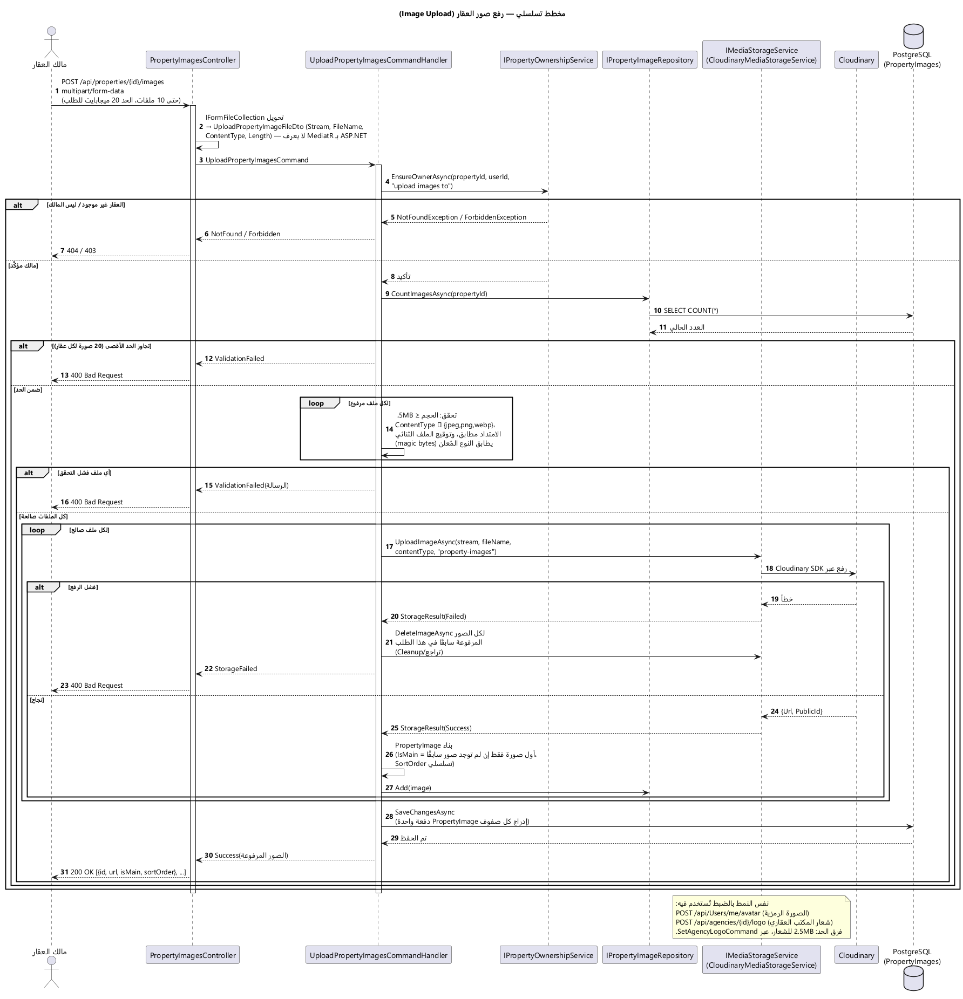
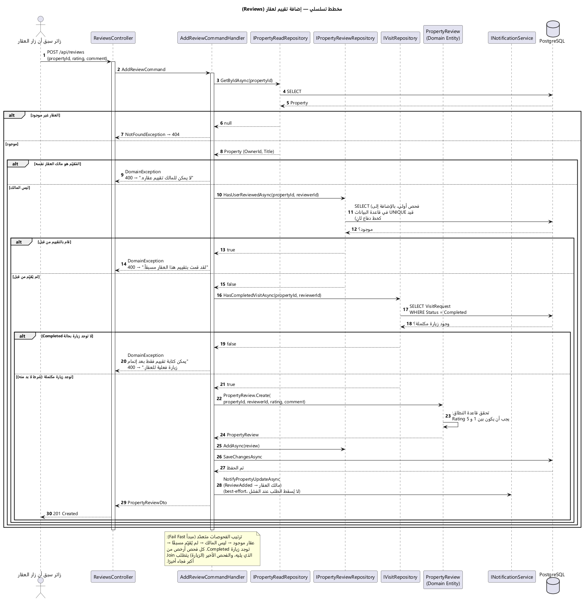
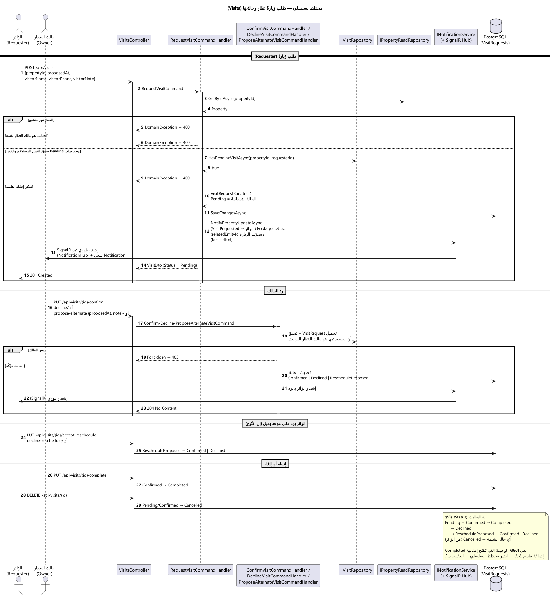
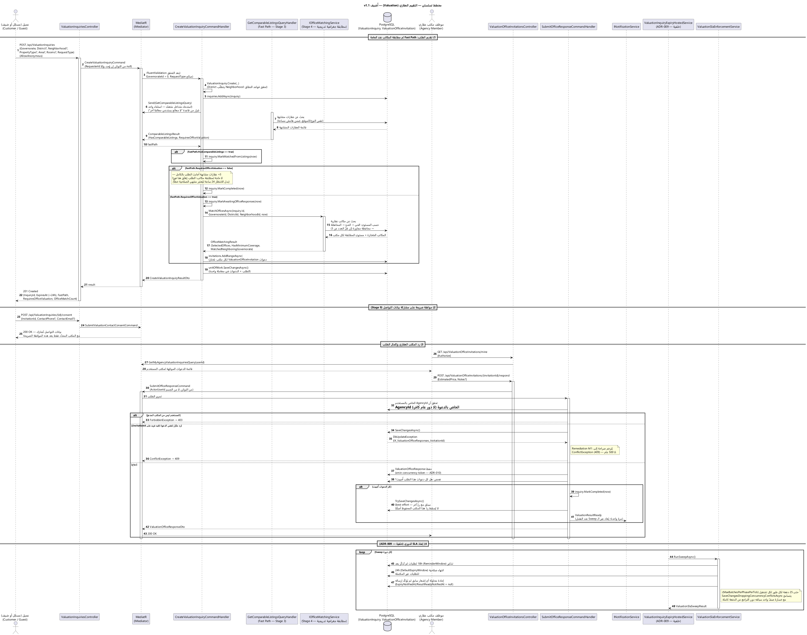

# وثيقة المرجع المعماري (Architectural Reference Document — ARD)
## نظام HudhudNestApi — منصّة هدهد نيست العقارية (HudhudNest)

| | |
|---|---|
| **اسم النظام** | HudhudNestApi (.NET 8 Web API) — الواجهة الخلفية لمنصّة «هدهد نيست» |
| **إصدار الوثيقة** | **2.0** |
| **تاريخ الإصدار** | 2026-10-02 |
| **الحالة** | معتمدة — مطابقة للكود على `master` عند commit `d153318` (PR #264) |
| **المستودع** | `Naeem-Ba/HudhudNestApi` (الخلفية) — `Naeem-Ba/HudhudNest` (الواجهة، مستودع منفصل) |
| **نطاق الفحص** | قراءة مباشرة لشيفرة المصدر: 4 مشاريع إنتاجية، **43 وحدة تحكم** و**~305 نقطة نهاية**، **74 `DbSet`**، **64 ترحيلة**، **9 مشاريع اختبار** + 3 أدوات، 9 سير عمل GitHub Actions، ملفات النشر والمراقبة |

> **ملاحظة عن ملفَّي `.docx` و`.pdf` المجاورين:** هما نسختان قديمتان مولَّدتان من الإصدار 1.x ولم تُعاد توليدهما مع هذا التحديث؛ **المرجع المعتمد هو هذا الملف `.md`** والمخططات في `diagrams/`. **تنبيه:** مصادر المخططات 01 و02 و03 (`.puml`) حُدِّثت لهذا الإصدار (مزوّدو OTP، ناشرو التواصل، النطاقات المخصّصة، مسار النشر، 43 وحدة تحكم/64 ترحيلة)، لكن **صور `.png` المقابلة لم تُعاد توليدها** لعدم توفّر Graphviz في بيئة التحرير؛ أعد توليدها بـ `plantuml -tpng diagrams/0[123]-*.puml` (تُظهر الصور الحالية حالة v1.1). المخططات 04–09 لم تتغيّر.

### سجلّ المراجعات (Revision History)

| الإصدار | التاريخ | الوصف | مبني على Commit |
|---|---|---|---|
| 1.0 | 2026-09-04 | الإصدار الأول — تحليل كامل لأربع طبقات النظام، 30 وحدة تحكم، 37+ ترحيلة | `a2cdd0f` |
| 1.1 | 2026-09-12 | وحدة التقييم العقاري (Valuation) + ADR-009/010/011 + نظرة موجزة على Investments/Social/Marketing/حذف الحساب | `1bffcec` |
| **2.0** | **2026-10-02** | **تحديث شامل بعد 151 commit:** إعادة التسمية الكاملة إلى HudhudNest وانتقال JWT إلى مُصدِر جديد بنافذة تحقق مزدوجة؛ OTP متعدد القنوات (SMS/Telegram/WhatsApp)؛ **ناشرو Social Distribution الحقيقيون** (تيليغرام/فيسبوك/إنستغرام) مع Lease وضبط `AmbiguousOutcome` ومفتاح إيقاف؛ إدارة تحديثات التطبيق (App Updates)؛ المراسلة وتقييم المالكين؛ الإقامة القصيرة (موقع/عملة/حصة)؛ كوكيز `Partitioned` وإصلاحات CSRF؛ ضغط الاستجابات وإصلاح تسمم الكاش وHSTS على Staging؛ حواجز فصل البيئات؛ بوابات CI الجديدة؛ تصحيح بنية النشر الفعلية؛ ADR-012…016 وتحديث ADR-011؛ سجل المخاطر R1–R18 | `d153318` |

---

## 1. المقدمة

### 1.1 الغرض من الوثيقة

توثيق المعمارية **الفعلية** لنظام HudhudNestApi كما هي مطبَّقة في الشيفرة اليوم — لا كما يُفترض أو يُخطَّط لها. كل ادّعاء تقني تم التحقق منه بالرجوع إلى الملفات (`Program.cs`، `DependencyInjection.cs`، وحدات التحكم، المعالجات، ملفات الإعداد، `docs/` وسير العمل). ما لم يمكن التحقق منه (لوحات Render/Netlify بلا صلاحية API، حسابات المنصّات الخارجية الحقيقية) مُعلَّم صراحةً بـ **[غير مُتحقَّق]**.

| الفئة | الفائدة من الوثيقة |
|---|---|
| مطوّرو الخلفية الجدد | فهم الطبقات وتدفقات العمل ونقاط التمديد قبل الكتابة |
| مطوّرو الواجهة (Angular / Capacitor) | عقود الـ API، حدود المصادقة، قيود CORS/CSRF/الكوكيز عبر البيئات |
| DevOps / SRE | بنية النشر، نقاط الفشل، المراقبة والتعافي |
| القيادة التقنية وأصحاب المصلحة | القيود الحالية وأثرها على خارطة الطريق |
| مراجعو الأمان | آليات المصادقة والتفويض وحدودها المعروفة |

### 1.2 نطاق الوثيقة

**تغطي:** الواجهة الخلفية بطبقاتها الأربع (`HudhudNestApi`، `.Application`، `.Domain`، `.Infrastructure`)؛ تكاملها مع PostgreSQL/PostGIS وRedis وCloudinary وResend/SMTP ومزوّدي SMS/OTP (Twilio، D7 Networks، Unimatrix، Telegram Gateway، WhatsApp Cloud API) وGoogle/Apple وHave I Been Pwned وواجهات Telegram/Meta للنشر الاجتماعي ومكدّس المراقبة؛ بيئتا Render (Staging وProduction) وخط CI/CD.

**لا تغطي:** داخل Angular SPA (مستودع `HudhudNest` المنفصل) وتطبيق Capacitor — يُذكران من زاوية العقد فقط (REST/JSON، الكوكيز، CORS، CSRF).

**عمق التغطية بحسب الوحدة:**

| عمق كامل (مخطط/ADR/تحليل أمني) | نظرة موجزة مسندة بدليل |
|---|---|
| المصادقة، العقارات، الوسائط، التقييمات، الزيارات، التقييم العقاري (Valuation)، النشر الاجتماعي (ADR-011/012)، OTP متعدد القنوات (ADR-013) | المكاتب العقارية، الإقامة القصيرة، سوق الخدمات، الإدارة، الاستثمار، التسويق ما قبل الإطلاق، حذف الحساب، App Updates، المراسلة |

### 1.3 تعريفات ومصطلحات

| المصطلح | التعريف |
|---|---|
| **ARD** | Architectural Reference Document — هذه الوثيقة |
| **CQRS** | فصل أوامر الكتابة عن استعلامات القراءة، مطبَّق عبر MediatR |
| **JWT / Refresh Token** | رمز وصول قصير (30 دقيقة) / رمز تحديث (30 يومًا) في كوكي HttpOnly مع كشف إعادة الاستخدام |
| **CSRF (Double-Submit)** | توكن مزدوج مبني على Antiforgery؛ يُعاد في جسم JSON لأن الأصلين لا يشتركان بنطاق |
| **CHIPS / `Partitioned`** | سمة كوكي تعزل الكوكي الطرف-الثالث لكل موقع أعلى؛ مطلوبة لبقاء كوكي التحديث `SameSite=None` يعمل في Chrome/Edge |
| **OTP Channel** | قناة تسليم رمز التحقق: `Sms` أو `Telegram` أو `WhatsApp`؛ الهاتف هو الهوية والقناة وسيلة تسليم فقط |
| **Lease / AmbiguousOutcome** | عقد حجز زمني على منشور قيد النشر؛ منشور عالق بعد انتهائه يصير «نتيجة غامضة» ولا يُعاد تلقائيًا أبدًا |
| **Dead Letter (DLQ)** | سجل منشور فشل نهائيًا يراجعه المشغّل (حلّ/إعادة جدولة) |
| **Kill-switch** | مفتاح إيقاف شامل `SocialDistribution:Enabled=false` |
| **Staging/Production Guard** | فحوص إقلاع تُسقط التطبيق إذا تداخلت إعدادات البيئتين |
| **SLO / SLI / RPO / RTO** | أهداف/مؤشرات مستوى الخدمة وأهداف التعافي (القسمان 6.1 و6.5) |
| **HudhudNest** | اسم المنصّة واسم مستودع الواجهة الأمامية |

### 1.4 المراجع

| المرجع | الموقع |
|---|---|
| المخططات (PlantUML + PNG) | `docs/architecture/ARD/diagrams/` |
| ADR: عزل أحمال Redis | `docs/architecture/adr-redis-workload-isolation.md` |
| تنسيق المصادقة | `docs/architecture/authentication-orchestration.md` |
| تأكيد البريد والتسليم | `docs/architecture/email-confirmation-and-delivery.md` |
| معمارية الوسائط (Cloudinary) | `docs/architecture/media-storage-architecture.md` |
| الإقامة القصيرة | `docs/architecture/short-stay.md` |
| المصادقة بالهاتف وإعادة التحقق وقنوات OTP | `docs/phone-password-authentication-and-reverification.md` |
| تقرير OTP متعدد القنوات | `docs/audit/multi-channel-otp-implementation-2026-09-24.md` |
| النشر الاجتماعي: الحالة/الإعدادات/التشغيل | `docs/social-distribution/README-AR.md`، `RUNBOOK-AR.md` |
| البيئات ودليل النشر | `docs/operations/environments-and-release-flow.md` |
| حالة إعادة التسمية | `docs/operations/hudhudnest-rename-rollout-2026-09-30.md` |
| خطة النشر للإنتاج | `docs/operations/production-deployment-plan-2026-09-20.md` |
| Redis HA / سياسة الفشل / RPO-RTO | `docs/operations/redis-ha-architecture.md`، `redis-failure-policy.md`، `rpo-rto.md` |
| إدارة تحديثات التطبيق | `docs/app-update-management.md` |
| SLO والمراقبة | `docs/observability/slo-definition.md`، `observability-architecture.md` |
| الخصوصية وجرد البيانات | `docs/privacy/data-inventory.md`، `docs/ACCOUNT-DELETION-PRODUCTION-READINESS.md` |
| تدقيق الكود الشامل | `docs/audit/FULL-CODE-AUDIT-REPORT.md` |
| بوابة الإصدار | `docs/testing/staging-production-gate-checklist.md` |
| دليل المستخدم / Pflichtenheft (مُشتقّان من هذه الوثيقة) | `docs/product/USER-GUIDE-AR.md`، `docs/product/PFLICHTENHEFT-AR.md` |

---

## 2. محركات المعمارية (Architectural Drivers)

### 2.1 متطلبات العمل

HudhudNestApi هي الواجهة الخلفية الوحيدة لمنصّة عقارية سورية/إقليمية متعددة الأدوار. الجدول مستخلَص من وحدات التحكم الـ43 الفعلية (`HudhudNestApi/Controllers`):

| المجال الوظيفي | الوظائف الأساسية | وحدات التحكم |
|---|---|---|
| الحسابات والمصادقة | تسجيل/دخول بالبريد أو الهاتف، دخول اجتماعي (Google/Apple)، استعادة كلمة المرور، **OTP متعدد القنوات**، إعادة تحقق الهاتف كل 180 يومًا (الإنفاذ قابل للتفعيل، معطّل افتراضيًا)، تغيير الهاتف، تسجيل موافقة شروط الخدمة عند التسجيل | `AuthController`، `PhoneAuthController`، `PhonePasswordAuthController`، `CsrfController` |
| إدارة العقارات | إنشاء/تعديل/نشر/تمديد، تسعير، صور، بحث نصي وجغرافي، تأكيد التوفّر، **مشاركة وتتبّع إسناد (UTM)**، إعلان مميّز | `PropertiesController`، `PropertyImagesController`، `LocationSuggestionsController`، `LookupsController`، `AmenitiesController` |
| المكاتب العقارية | تسجيل مكتب، دعوات أعضاء، نقل ملكية، شعار | `AgenciesController` |
| التفاعل | زيارات (تأكيد/رفض/اقتراح بديل/إكمال)، تقييم العقار، **صندوق رسائل للمالك**، مفضّلات، بحث محفوظ، **تقييم المالكين بمحورين اختياريين**، إشعارات | `VisitsController`، `ReviewsController`، `MessagesController`، `FavoritesController`، `SavedSearchController`، `NotificationsController`، `UsersController` |
| الإقامة القصيرة | وحدات إقامة، حجوزات (موافقة/عربون/تأكيد/وصول/مغادرة)، قواعد تسعير وحد أدنى، **عملة لكل إعلان، موقع منظّم + دبوس اختياري + بوابة نشر**، **حصة موحّدة مع العقارات** | `ShortStayListingsController`، `ShortStayBookingsController`، `ShortStayReviewsController` |
| سوق الخدمات | مزوّدو خدمات، عروض، طلبات خدمة بدورة حياة كاملة، مستندات، تقييمات | `ServiceProvidersController`، `ServiceOfferingsController`، `ServiceRequestsController` |
| التقييم العقاري (Valuation) | طلب تقييم (ضيف/مسجّل)، مطابقة سريعة (Fast Path)، مطابقة جغرافية تدريجية مع مكاتب، دعوات وردود، SLA 24 ساعة (تذكير عند 18)، موافقة قبل مشاركة بيانات التواصل | `ValuationInquiriesController`، `ValuationOfficeInvitationsController` |
| الاستثمار العقاري | مشاريع استثمارية (عام)، **تعبير عن اهتمام** (لا التزام مالي)، حاسبة، قائمة مراقبة، مستندات، **دورة موافقة إدارية** (مراجعة/موافقة/جدولة/نشر/تعليق/إغلاق) | `InvestmentsController`، `AdminInvestmentsController` |
| **النشر الآلي على التواصل الاجتماعي** | قنوات ← حسابات ← قواعد ← منشورات ← طابور ← عامل خلفي ← Dead Letters؛ **ناشرون حقيقيون** لتيليغرام وفيسبوك وإنستغرام؛ مفتاح إيقاف؛ لوحة ومقاييس (ADR-011/012) | `SocialDistributionController` (Admin فقط) |
| التسويق ما قبل الإطلاق | عملاء محتملون (Leads)، عروض (Offers)، استبيانات، أحداث تسويقية | `LeadsController`، `OffersController`، `SurveysController`، `MarketingEventsController` |
| **إدارة تحديثات التطبيق** | فحص عام `GET /api/app-updates/check` (Android/IOS/Web) والإلزام **مشتقّ** من `MinimumSupportedVersion`؛ CRUD إداري بحذف ناعم | `AppUpdatesController`، `AdminAppReleasesController` |
| الإدارة والتشغيل | مستخدمون/أدوار/اشتراكات/إبراز، صحة، **`/api/operational/version`**، مراقبة اصطناعية | `AdminController`، `OperationalController`، `ObservabilitySyntheticController` |
| الخطط والتحليلات | أربع خطط (مجانية/أساسية 49$/بريميوم 99$/نخبة)، تحليلات عقار وسوق | `PlansController`، `AnalyticsController`، `EnumController` |
| حذف الحساب (GDPR) | جدولة حذف بنافذة **30 يومًا** قابلة للإلغاء، تصدير بيانات، موافقات وسحبها | `UsersController` |

**فجوات توثيق معروفة (v2.0):** Investments وMarketing وحذف الحساب وApp Updates والمراسلة موثَّقة هنا بنظرة موجزة دون مخطط تسلسلي أو ADR مستقل؛ أي قرار اعتماد عليها يسبقه فحص كود مباشر.

**متطلبات غير وظيفية مستخلَصة من الكود:**
- **لا كشف لوجود الحساب (No Enumeration Oracle):** استجابة دخول موحّدة بصرف النظر عن السبب؛ ولا يعرض الـ 401 عدّاد «محاولات متبقية» وهميًا (إصلاح #243).
- **هوية المستخدم من التوكن لا من الجسم** في كل وحدة (`OwnerId = GetCurrentUserId()`).
- **تنظيف الفشل الجزئي:** رفع الصور يحذف المرفوع جزئيًا عند فشل لاحق (عقارات، إقامة قصيرة).
- **الأرقام لا تُختلَق:** مدقّق الحقائق في النشر الاجتماعي يرفض الأسعار والروابط غير المطابقة للعقار.

### 2.2 متطلبات الجودة

| الصفة | كيف تتحقق فعليًا | الدليل |
|---|---|---|
| **الأمان** | JWT + Refresh مدوَّر بكشف إعادة الاستخدام، CSRF مزدوج، رؤوس أمان، HSTS (Production **وStaging**)، تحديد معدل Redis لكل نقطة حساسة، HIBP، توقيع ثنائي للصور، حواجز فصل البيئات | `Program.cs`، `PasswordSecurityService.cs`، `ProductionEnvironmentGuard.cs`، `StagingEnvironmentGuard.cs` |
| **الأداء** | SLO: 95% ≤ 500ms؛ **Output Cache عبر Redis بسياسات مسمّاة**؛ **ضغط Brotli/Gzip حتى على HTTPS**؛ كاش Security Stamp | `OutputCacheRegistration.cs`، `Program.cs:126` |
| **التوسّع** | بلا حالة على مستوى العملية؛ SignalR backplane وOutput Cache وتحديد المعدل موزَّعة عبر Redis؛ **أقفال استشارية (Advisory Locks)** للحصص وحدّ إرسال OTP؛ **`BackgroundJobLock`** لكل عامل خلفي | `ListingQuotaLock`، `BackgroundJobLockKeys.cs` |
| **الموثوقية/التعافي** | RPO ≤ 60 دقيقة، RTO ≤ 120 دقيقة (سير عمل تعافٍ آلي)؛ **النسخ الاحتياطي يعمل مرة يوميًا** (#236) — راجع تنبيه القسم 6.5؛ Redis HA بـ Sentinel مُختبَر في CI؛ **فشل دورة عامل خلفي لا يوقف المضيف** (#204) | `database-backup.yml`، `redis-ha-failover.yml` |
| **القابلية للصيانة** | فصل طبقات مفروض آليًا (133 اختبار معماري)؛ CQRS موحّد | `tests/HudhudNestApi.Architecture.Tests` |
| **القابلية للنشر** | صورة `chiseled` متعددة المراحل؛ `production-gate.yml`؛ **نشر Production يدوي فقط**؛ Rollback مؤتمت | `Dockerfile`، `rollback-production.yml` |
| **إمكانية المراقبة** | OpenTelemetry من أول سطر؛ مقاييس `hudhudnest_*`؛ **عدّادات النشر الاجتماعي وOTP** وتنبيهات؛ تنقيح (Redaction) في الـ Collector | `observability/` |

### 2.3 القيود

| القيد | الأثر المعماري |
|---|---|
| **.NET 8 / Clean Architecture من 4 مشاريع** | اتجاه الاعتماد مفروض آليًا؛ ترقية إلى .NET 10 مخطَّطة (`docs/operations/net10-migration-plan.md`) وصور Docker الأساسية محجوبة عن قفزات الإصدار الرئيسي (#200) |
| **PostgreSQL + PostGIS وحيدة** | البحث الجغرافي عبر PostGIS؛ فهارس trigram للبحث النصي (#212)؛ **Render Postgres المجاني ينتهي** → خطة الانتقال إلى Supabase (`database-host-migration-runbook.md`) — لم تُنفَّذ بعد |
| **Cloudinary بخطة مجانية (بيئة واحدة)** | العزل بين البيئتين **بمجلد جذر**: `staging/` تلقائيًا في Staging و`hudhudnest/` في Production (#244)، لا عزل تخزين فعلي؛ تخطيط مجلدات مركزي لكل كيان (`IMediaFolderBuilder`) |
| **مستودعان منفصلان** | أي تغيير في عقد HTTP يتطلب تنسيقًا يدويًا؛ سُمّي عطل CSRF التاريخي مثالًا |
| **الواجهة (Netlify) والخلفية (Render) بنطاقين مختلفين** | CSRF في جسم JSON + كوكيز `SameSite=None; Secure; Partitioned`. **جديد:** نطاقان مخصّصان `api.hudhudnest.com` و`staging-api.hudhudnest.com` مفعّلان (2026-09-30) والمضيفان القديمان `*.onrender.com` ما زالا يعملان؛ تحويل الواجهة إليهما **لم يتم** بعد |
| **Render Free لـ Staging** | بلا Shell ولا نسخ احتياطي لقاعدة Staging؛ الترحيلات لا تُطبَّق عند الإقلاع في أي بيئة — `tools/HudhudNestApi.Migrator` (وسير العمل يهاجر Staging قبل النشر) |
| **Resend بنطاق موثَّق واحد** | الفصل بمفتاح API مختلف لكل بيئة؛ فحص أن Staging لا يرسل لعناوين حقيقية **[غير مُتحقَّق]** |
| **عدم وصول Twilio وWhatsApp إلى سوريا** | Twilio لا يسلّم إلى سوريا (أُضيف D7/Unimatrix)؛ WhatsApp غير متاح لسوريا (+963 في `OtpChannels:WhatsApp:UnavailableCountryCodes`)؛ SMS عبر Unimatrix: «Delivered» بلا وصول فعلي — **غير محلول** |

---

## 3. نظرة عامة على النظام

### 3.1 وصف النظام

**HudhudNestApi** واجهة REST بـ **.NET 8** تخدم منصّة عقارية متعددة الأدوار: باحثون (إيجار/شراء/إقامة قصيرة)، ملّاك ووسطاء، مكاتب عقارية، مزوّدو خدمات، مستثمرون، مسؤولو نظام. المعمارية **Clean Architecture** بأربع طبقات فيزيائية مع **CQRS** عبر **MediatR**، وPostgreSQL/PostGIS للبيانات.

النظام بلا حالة على مستوى العملية: أي حالة تنجو بين الطلبات تُحفَظ في PostgreSQL أو Redis. العوامل الخلفية الثمانية (القسم 4.3) تتشارك العمل عبر أقفال `BackgroundJobLock` فلا تتكرر عند تعدد النسخ.

### 3.2 سياق النظام



*(المصدر: `diagrams/01-system-context.puml` — المصدر محدَّث لـ v2.0، والصورة تعكس v1.1 حتى تُعاد توليدها)*

HudhudNestApi هو النظام الوحيد الذي يملك منطق العمل وقاعدة البيانات. الواجهة الأمامية وتطبيقا الجوال عميلان بلا منطق مستقل. **التبعيات كلها صادرة**: لا Webhooks واردة (استدعاء Telegram للتقارير غير مُنفَّذ عمدًا). الأنظمة الخارجية: PostgreSQL، Redis، Cloudinary، Resend/SMTP، مزوّدو SMS (Twilio/D7/Unimatrix/عام)، Telegram Gateway وWhatsApp Cloud (OTP)، Telegram Bot API وMeta Graph API (نشر)، Google/Apple، HIBP، مجمّع OpenTelemetry.

### 3.3 الأهداف المعمارية

1. حماية سلامة البيانات المالية والقانونية بتحقق صارم في طبقة النطاق.
2. منع تسريب المعلومات عبر قنوات جانبية (استجابات الدخول، رسائل الأخطاء، **سجلات التطبيق**: لا توكن في URL ولا في السجلات — #256).
3. إبقاء التوسّع الأفقي ممكنًا دون إعادة تصميم.
4. مركزية قرارات التفويض (`IPropertyOwnershipService`).
5. الملاحظة جزء من الإقلاع (`AddHudhudNestApiObservability()` أول سطر تنفيذي).
6. **جديد:** عدم اختلاق قدرات غير موجودة — الناشر غير المُعدّ يُرجع `PlatformNotConfigured` ولا يختلق `ExternalPostId`، والواجهة تعرض `isLive` الحقيقي.

---

## 4. وجهات النظر المعمارية

### 4.1 وجهة النظر المنطقية

```
HudhudNestApi (API) ──▶ HudhudNestApi.Application ──▶ HudhudNestApi.Domain
        │                         ▲
        └─────────────────────────┘
HudhudNestApi.Infrastructure ──implements──▶ Application ; ──▶ Domain
```

`HudhudNestApi.Domain` لا يعتمد على أي مشروع أو حزمة إطار — مفروض بـ `HudhudNestApi.Architecture.Tests`. السياقات (Bounded Contexts) في الطبقات الثلاث: Admin، Agencies، Amenities، Analytics، **AppUpdates**، Auth، Bookings، Contact، Favorites، Investments، Listings، Lookups، Marketing، **Messaging**، Notifications، Plans، Properties، Reviews، Search، Services، ShortStay، **SocialDistribution**، Transactions، Users، **Valuation**، Audit.



*(المصدر: `diagrams/03-component.puml` — المصدر محدَّث لـ v2.0، والصورة تعكس v1.1 حتى تُعاد توليدها)*

| الطبقة | المسؤولية | أمثلة |
|---|---|---|
| **HudhudNestApi** (API) | HTTP، تحويل DTO ↔ MediatR، Middleware، الأمان الحدودي، **جذر التركيب `Configuration/`** (CORS، JWT، Redis، SignalR، Swagger، OutputCache، RateLimiting، حواجز البيئة) | 43 وحدة تحكم؛ `Program.cs` |
| **Application** | التنسيق (Orchestration) بلا معرفة بـ ASP.NET/EF؛ أوامر/استعلامات؛ FluentValidation؛ واجهات | `Auth/Orchestration`، `SocialDistribution/Services` |
| **Domain** | كيانات ذات سلوك وقواعد ثابتة | `Agency.Create`، `ListingLifecyclePolicy` (30 يومًا نشر + 30 يومًا مهلة، تحذير قبل 5 أيام) |
| **Infrastructure** | EF Core/Npgsql، Cloudinary، Resend/SMTP، Redis، SignalR، مزوّدو SMS/OTP، ناشرو المنصّات | `AppDbContext` (74 `DbSet`)، `SocialDistribution/Publishing` |

**نمط CQRS:** `Controller → IMediator.Send → TelemetryBehavior → LoggingBehavior → ValidationBehavior → Handler → Domain Entity + Repository/UnitOfWork` — مسجَّل في `Application/DependencyInjection.cs` وثابت لكل أمر.

### 4.2 وجهة النظر التطويرية

- حل واحد `HudhudNestApi.sln`: 4 مشاريع إنتاجية + 9 مشاريع اختبار + 3 أدوات (`HudhudNestApi.Migrator`، `.DatabaseRecoveryVerifier`، `.PerformanceDataGenerator`).
- إدارة حزم مركزية (`Directory.Packages.props`) + `packages.lock.json` + `dotnet restore --locked-mode`.
- **تنبيه:** توجد مجلدات `PropertyApi*` متبقية على بعض أجهزة التطوير (`bin/` و`obj/` فقط) من التسمية القديمة — غير متتبَّعة في Git ولا علاقة لها بالحل.

| مشروع الاختبار | الغرض | عدد الاختبارات المُعلَنة* |
|---|---|---:|
| `Application.Tests` | وحدة لمعالجات الأوامر/الاستعلامات | 1117 |
| `Integration.Tests` | تكامل مع PostgreSQL/Redis حقيقيين (WebApplicationFactory) | 444 |
| `Auth.Tests` | وحدة المصادقة عبر الطبقات | 239 |
| `Infrastructure.Tests` | مكوّنات Infrastructure (ناشرون، مزوّدو OTP، خدمات خلفية) | 162 |
| `Architecture.Tests` | قيود المعمارية — **بوابة CI**: اتجاه الاعتماد، قائمة النقاط العامة المعتمدة، ترتيب الوسطاء، حراس Redis/Options/Observability/ترميز المصدر | 133 |
| `Performance.Tests` | أداء مقابل خط أساس محفوظ (ميزانيات معتمدة، #161) | 8 |
| `Observability.Tests` | التحقق من التصدير الفعلي | 7 |
| `Concurrency.Tests` | سيناريوهات تزامن (Valuation A/B/C/D) | 4 |
| `StagingSmokeTests` | رحلات E2E ضد Staging المنشورة | 1 (رحلة طويلة) |

\* عدد تصريحات `[Fact]/[Theory]` في المصدر وقت التحرير، **ليس** عدد الحالات المنفَّذة ولا نتيجة تشغيل.

**بناء الحاوية:** `sdk:8.0` ← `aspnet:8.0-jammy-chiseled-extra`: بلا shell ولا مدير حزم، مستخدم غير جذري.

### 4.3 وجهة النظر العملية

**ترتيب الـ Middleware الفعلي** (`Program.cs:210-318`):

```
 1. UseForwardedHeaders
 2. [Production|Staging] Request.Scheme = "https"   ← قسر النظام لأن Request.IsHttps غير موثوق خلف Render/Cloudflare
 3. UsePerformanceInstanceHeader / UsePerformanceDatabaseDiagnostics
 4. UseHudhudNestApiObservability
 5. [Production|Staging] UseHsts            (365 يومًا، IncludeSubDomains، Preload)
 6. [غير Production]     UseHttpsRedirection
 7. ExceptionHandlingMiddleware
 8. UseHudhudNestApiSecurityHeaders
 9. UseResponseCompression                  (Brotli + Gzip، مفعّل على HTTPS)
10. Swagger/SwaggerUI  — Development/Testing/CI، أو غير-Production مع Swagger:Enabled
11. UseStaticFiles  12. UseRouting
13. UseCors("DefaultCors")
14. UseAuthentication
15. PhoneVerificationRestrictionMiddleware
16. UseRedisRateLimiting | UseRateLimiter   (واحد فقط، يُختار من الإعدادات النهائية بعد Build عبر IsRedisRateLimitingActive)
17. UseCookieCsrfProtection
18. UseAuthorization
19. UseOutputCache
20. MapOperationalHealthEndpoints / MapControllers / MapHub("/notificationHub")
```

**الإقلاع:** `StagingEnvironmentGuard` و`ProductionEnvironmentGuard` يُسقطان العملية إن تداخلت إعدادات البيئتين (اسم القاعدة، علامات العزل `Staging__*Marker`، مجلد التخزين)؛ `RedisConnectionResolver` يطبّع `redis://`/`rediss://` (يضبط المنفذ الافتراضي ويحفظ مستخدم ACL ويفرض TLS لـ Upstash — #264)؛ اتصال Redis **مبكر** قبل بدء Kestrel لمنع 503 على أول طلبات بعد النشر (#164)؛ ثم `SeedReferenceDataAsync` (بيانات مرجعية فقط، **لا ترحيلات**). ثقافة ثابتة (Invariant) وJSON camelCase بلا استثناء (B-11).

**العوامل الخلفية (Hosted Services) — 8 + مدقّق إقلاع:**

| الخدمة | الدورة | الغرض |
|---|---|---|
| `ListingExpiryHostedService` | 6 ساعات | تحذير قبل 5 أيام، انتهاء بعد 30 يومًا، حذف بعد 30 يومًا مهلة |
| `SavedSearchMatchHostedService` | 15 دقيقة | مطابقة عمليات البحث المحفوظة وإشعارها |
| `ValuationInquiryExpiryHostedService` | 15 دقيقة | SLA التقييم (ADR-009) |
| `SocialPublicationDispatchHostedService` | دقيقتان | إرسال المنشورات + تحرير العالقة (Lease) + Reconciliation كل دورتين، حتى 25 منشورًا/دورة |
| `PhoneVerificationHostedService` | ساعة | حالة إعادة تحقق الهاتف (180 يومًا + 3 أيام مهلة)؛ **معالجة التذكيرات معطّلة افتراضيًا** (`PhoneVerification:ReminderProcessingEnabled=false`) |
| `AccountDeletionSweepHostedService` | ساعة | تنفيذ حذف الحساب بعد انتهاء النافذة (30 يومًا) |
| `AuditLogRetentionHostedService` | 24 ساعة | الاحتفاظ بسجل التدقيق (التعطيل افتراضي: `RetentionDays=0`) |
| `SecurityAlertBackgroundService` | طابور | إرسال التنبيهات الأمنية بالبريد |
| `ProductionStartupValidator` | عند الإقلاع | فحوص إعداد Production |

كلها تحمي نفسها بـ `BackgroundJobLock.TryRunAsync` (مفتاح لكل خدمة)، وفشل دورة واحدة لا يوقف المضيف.

**إدارة الأخطاء غير الحرجة:** العمليات الثانوية (إشعار، بريد، اقتراح موقع، **تنبيه AddEmail**) داخل `try/catch` منفصل — «Fail Fast للتحقق، Best-Effort للتبعيات الثانوية».

**التخزين المؤقت للمخرجات:** مطلوب Redis في Staging/Production (يُسقط الإقلاع دونه). المفتاح `HudhudNestApi:{Env}:v1:OutputCache:`، الحد 2 ميغابايت للجسم و128 ميغابايت للمجموع. السياسات: `market-insights` (5 دقائق، تتنوّع بـ `countryCode`)، `public-property-list` (30 ثانية، تتنوّع بقائمة مفاتيح الاستعلام الـ28 كاملة)، `public-property-details` (60 ثانية). **إصلاح تسمم الكاش (#254):** سقطت سابقًا مفاتيح (`searchTerm`، `governorateId`، …) فاصطدم طلبان مختلفان على مدخل واحد؛ يفرض الآن `OutputCacheVaryByQueryTests` تطابق القائمة مع `PropertyFilterDto` بالانعكاس.

### 4.4 وجهة النظر الفيزيائية/النشر



*(المصدر: `diagrams/02-deployment.puml` — المصدر محدَّث لـ v2.0، والصورة تعكس v1.1 حتى تُعاد توليدها)*

| | Production | Staging |
|---|---|---|
| الواجهة | `https://hudhudnest.com` (Netlify، فرع `main`) | `https://staging--hudhudnest.netlify.app` (فرع `staging`)؛ معاينات PR تتصل بـ Staging API |
| API (مضيف Render) | `wohnungen-api.onrender.com` — **نطاق مخصّص `api.hudhudnest.com`** | `propertyapi-staging-api.onrender.com` (`srv-dacpbgf40ujc73epheig`) — **نطاق مخصّص `staging-api.hudhudnest.com`** |
| `ASPNETCORE_ENVIRONMENT` | `Production` | `Staging` |
| قاعدة البيانات | PostgreSQL+PostGIS منفصلة (`DATABASE_URL`، يرفض الحارس أي اسم يحوي `staging`) | `propertyapi-staging-db` (PostgreSQL 18، Free، بلا نسخ احتياطي، ~30 يومًا؛ يفرض الحارس أن الاسم يحوي `staging`) |
| Redis | Upstash منفصل | Valkey 8 على Render `hudhudnest-redis` |
| Cloudinary | جذر `hudhudnest/` | جذر `staging/` (نفس الـ cloud) |
| مشغّل النشر | **يدوي فقط:** `workflow_dispatch` على `master` → `deploy-production` (يتحقق أن `github.sha` ما زال رأس `master`) | تلقائي بعد الدمج: خطوة `staging-smoke` في `Production Gate` (هجرة القاعدة ← Deploy Hook ← انتظار `build-info` بنفس الـ commit ← E2E) |
| الترحيلات | `tools/HudhudNestApi.Migrator` (لا تطبيق عند الإقلاع) | نفسه، تلقائيًا ضمن `staging-smoke` |
| `ForwardedHeaders` | مفعّل مع `KnownNetworks` | **معطّل** (لا نطاق وكيل موثَّق من Render) — يُعوَّض بقسر `Request.Scheme="https"` |
| مؤشر البيئة المرئي | شارة `🟢 PRODUCTION` للأدمن فقط | شارة `🟠 STAGING` للجميع |
| التحقق من النسخة | `GET /api/operational/version` (Admin) | نفسه + `GET /api/operational/build-info` (رأس سرّي، Staging فقط؛ يعيد `RENDER_GIT_COMMIT`) |

**أثر تعطيل ForwardedHeaders على Staging:** تقسيم تحديد المعدل بحسب IP يرى عنوان حافة Render الواحد، فتُشارَك الحصص بين زوّار Staging — خطر معروف ومقبول (R3). وتستثني بوابة الدخان حركة اختبار الدخان من حصص OTP (#142).

**CI/CD — 9 سير عمل** (المشغّلات مثبّتة على `ubuntu-24.04`): `ci.yml`؛ `production-gate.yml` (بناء + اختبارات + أداء + Staging smoke + استرداد القاعدة + `production-deployment-gate` + `deploy-production` اليدوي)؛ `database-backup.yml` (يوميًا)؛ `database-restore-drill.yml`؛ `observability-validation.yml`؛ `performance-validation.yml`؛ `redis-ha-failover.yml` (Primary+Replica+3 Sentinels عند الطلب)؛ `rollback-production.yml` (يتطلب `dep-…` سليم ورقم حادثة واسم الموافق وتعطيل Auto-Deploy)؛ `supply-chain-validation.yml`.

**فجوات نشر معروفة** (من `environments-and-release-flow.md` §7): حماية `master` غير مفعّلة (الخطة) وبيئات GitHub بلا Required reviewers؛ Auto-Deploy لخدمة Production في Render **[غير مُتحقَّق]**؛ الواجهة تُنشر لـ Production من `main` تلقائيًا دون المرور بـ Staging.

### 4.5 وجهة النظر الأمنية

**المصادقة**
- **JWT** (30 دقيقة) + **Refresh Token** (30 يومًا) في كوكي `HttpOnly; Secure; SameSite=None; Partitioned` — لا يظهر رمز التحديث في أي جسم استجابة. `Secure` يُحسب من `Request.Scheme` المقسور إلى https (Production/Staging).
- **المُصدِر/الجمهور:** القيم الافتراضية `HudhudNest`/`HudhudNestClient`، مع قبول القيم القديمة (`PropertyApi`) عبر `Jwt:AdditionalValidIssuers/Audiences` طوال نافذة انتقال (ADR-013). تُقرأ القيم **كسولًا** داخل `AddJwtBearer`.
- **كشف إعادة استخدام رمز التحديث:** يُبطَل كل الرموز النشطة ويُدوَّر SecurityStamp وتُسجَّل `RefreshTokenReuseDetected`.
- **دخول اجتماعي:** Google (مع مهلة إشرافية لتحقق ID Token — #159) وApple (nonce خام — B-16) عبر `SocialAuthenticationOrchestrator`.
- **الهاتف:** كلمة مرور + OTP؛ رمز صلاحيته 5 دقائق مع حجز دقيقتين وتوقيع HMAC؛ **حدّ إرسال متسلسل بقفل استشاري** (#245) وحارس «ضخّ SMS» (#208) ومهلة للمزوّد؛ رفض الحسابات المحظورة وتسوية زمن الاستجابة (#205)؛ **إعادة تحقق كل 180 يومًا + 3 أيام مهلة** تفرضها `PhoneVerificationRestrictionMiddleware` — **الإنفاذ معطّل افتراضيًا في `appsettings.json`** (`PhoneVerification:EnforcementEnabled=false`، مع `ExistingAccountTransitionDays=30` للحسابات القائمة)؛ قيمته الفعلية في Staging/Production تُضبط في Render **[غير مُتحقَّق]**.
- **قنوات OTP (ADR-014):** `Sms` (Twilio/D7/Unimatrix/عام HTTP/Console)، `Telegram` (Gateway الرسمي)، `WhatsApp` (Cloud API، قالب AUTHENTICATION، معطّل افتراضيًا).
- **سياسة كلمة المرور:** HIBP (k-anonymity) بقاطع دارة، وتُطبَّق نفس السياسة على Register وReset وChange (#156).
- **موافقة شروط الخدمة** تُسجَّل عند التسجيل (`ConsentPolicyType.TermsOfService`، #252).

**التفويض:** الأدوار `User, Agent, Admin, AgencyOwner, AgencyAgent`؛ الدور وحده لا يكفي — كل معالج يقارن `OwnerId`/`AgencyId`. **كل نقاط `SocialDistribution` و`AdminInvestments` و`AdminAppReleases` وبقية الإدارة مقصورة على `Admin`** (25 تصريحًا بدور Admin في وحدات التحكم).

**حماية CSRF:** توكن مزدوج مبني على `IAntiforgery`؛ `GET /api/security/csrf-token` يُعيده في جسم JSON وكوكي قابل للقراءة (ADR-007). تعديلات لاحقة: **طلبات Bearer المُصادَقة لا تُطالَب بتوكن مُولَّد لمجهول** (#238)؛ `logout` لا يفشل CSRF (#173)؛ `refresh` يتطلب Bearer صالحًا؛ الكوكيز `Secure` قسرًا في Production (#155) و`Partitioned` (CHIPS).

**تحديد المعدل:** Redis في Production (نافذة ثابتة)؛ سياسة مستقلة لكل نقطة — الجدول في 6.3.

**الحماية عند الوصول للمنصّات الخارجية:** توكن تيليغرام لا يمر في أي سجل HttpClient؛ فيسبوك/إنستغرام ترسل التوكن في جسم POST لا في URL؛ `SocialAccountDto` لا يحمل حقل اعتماد (`hasCredential` فقط)؛ بيانات الاعتماد لكل حساب مشفَّرة؛ اختبارات تلتقط كل السجلات (`SocialPublisherHttpLoggingTests`).

**الملفات المرفوعة:** تحقق من التوقيع الثنائي (JPEG/PNG/WebP) + حدود (5 ميغابايت/صورة؛ 20 صورة لكل إعلان إقامة؛ 10/طلب).

**القيد المقبول:** المكاتب العقارية تجميع تنظيمي لا عزل مستأجرين (ADR-006).

**أسرار الإنتاج:** تُضبط في Render بيد المالك فقط؛ **مفتوح:** تدوير `Jwt__Key` و`OtpSettings__SecretKey` في Production (R12).

---

## 5. قرارات التصميم المعماري

### 5.1 الأنماط

| النمط | أين | لماذا |
|---|---|---|
| Clean Architecture | الحل كله | عزل قواعد العمل عن التفاصيل التقنية |
| CQRS عبر MediatR | كل وحدة | فصل الكتابة عن القراءة؛ Pipeline Behaviors |
| Rich Domain Model | `Domain` | القواعد داخل الكيان (`Agency.Create`، آلة حالة الزيارة) |
| Repository + Unit of Work | `Infrastructure` | معاملة واحدة للطلب |
| Ports & Adapters | `ISocialPublisher`، `ISocialContentGenerator`، `IOtpProvider`، `IMediaStorageService`، `ISmsService` | استبدال التنفيذ دون المساس بالمستهلك |
| Best-Effort للثانويات | عشرات المعالجات | فشل بريد/إشعار لا يُسقط عملية محفوظة |
| Event-Driven جزئي | SignalR + `PropertyPublishedEvent`/`PropertyStatusChangedEvent`/`PropertyDeletedEvent` | إشعارات فورية + زناد التوزيع الاجتماعي |
| Outbox خفيف / Lease | `SocialPublication.LeaseUntil` | منع النشر المزدوج بعد انقطاع (ADR-012) |

### 5.2 مبادئ التصميم

1. لا تثق بمعرّف حسّاس من العميل. 2. مركزية التفويض. 3. فشل سريع للتحقق وتسامح للثانويات. 4. ترتيب الفحوصات بحسب التكلفة. 5. لا تسريب عبر فروق الاستجابة. 6. **جديد:** لا نجاح مزيَّف — حالة غير معروفة (`AmbiguousOutcome`) تُعلَن ولا تُخمَّن. 7. **جديد:** الإلزام يُشتقّ ولا يُخزَّن (App Updates: لا عمود `IsMandatory`).

### 5.3 قرارات التقنية

| التقنية | الدور | التبرير |
|---|---|---|
| .NET 8 / ASP.NET Core | المنصّة | LTS، أداء، Middleware ناضج |
| PostgreSQL + PostGIS + EF Core/Npgsql | القاعدة | استعلامات جغرافية + ACID؛ `xmin` للتزامن |
| MediatR + FluentValidation | CQRS | نقطة تمديد موحّدة |
| Redis (StackExchange) | تحديد معدل، كاش مخرجات، Security Stamp، SignalR | حالة مشتركة |
| Cloudinary | الوسائط | تحويل جاهز؛ تخطيط مجلدات مركزي |
| Resend / SMTP / Console | بريد | `Console` مرفوض في Production |
| Twilio / D7 / Unimatrix / HTTP عام | SMS | Twilio لا يسلّم إلى سوريا |
| Telegram Gateway / WhatsApp Cloud | OTP | قنوات بديلة اقتصادية |
| Telegram Bot API / Graph API | نشر اجتماعي | ناشرون حقيقيون بوجود التوكن |
| SignalR | إشعارات فورية | بدل Polling |
| OpenTelemetry + Prometheus/Grafana/Tempo | مراقبة | معيار مفتوح |
| Docker `chiseled` | تغليف | سطح هجوم أصغر |

### 5.4 قرارات التكامل

- **Cloudinary:** `IMediaStorageService` ← `CloudinaryMediaStorageService`؛ المجلدات عبر `IMediaFolderBuilder` (نقية بلا I/O) وبجذر حسب البيئة؛ تنظيف عند الفشل الجزئي.
- **البريد:** `Email:Provider` (Console|Smtp|Resend)؛ يُسجَّل معرّف رسالة Resend ويُتحقَّق من `Email:From` (#237).
- **SMS/OTP:** `ISmsService` مغلَّف بـ `SmsOtpProvider`؛ `OtpChannelService` يقرّر التوفّر والتوصية؛ التحوّل بين القنوات **بمبادرة المستخدم** لا الخادم.
- **النشر الاجتماعي:** `ISocialPublisher` لكل منصّة؛ سجلّ `SocialPublisherRegistry`؛ تيليغرام/فيسبوك/إنستغرام حقيقية، وTikTok/YouTube/LinkedIn **Placeholder عمدًا** (تعطّلها الواجهة عبر `isLive`).
- **المراقبة:** OTLP/gRPC فقط إلى المجمّع.

### 5.5 سجلّ قرارات التصميم المعماري (ADR)

> القرارات 001–011 كما في v1.1 مع التحديثات المذكورة؛ 012–016 جديدة في v2.0.

#### ADR-001 — Clean Architecture بأربع مشاريع مع اختبارات معمارية آلية
- **الحالة:** مقبول ومطبَّق. **القرار:** فصل فيزيائي إلى 4 مشاريع و`Architecture.Tests` كبوابة CI (133 اختبارًا). **المرفوض:** قواعد نصّية بلا إنفاذ؛ طبقة واحدة. **الأثر:** كتابة أولى أبطأ مقابل صيانة أفضل.

#### ADR-002 — رمز وصول قصير + رمز تحديث دوّار في كوكي HttpOnly مع كشف إعادة الاستخدام
- **الحالة:** مقبول ومطبَّق. **القرار:** Access 30 دقيقة في الجسم؛ Refresh 30 يومًا في كوكي فقط (الآن `Partitioned` — ADR-015)؛ إعادة الاستخدام تُبطل كل الرموز وتدوّر SecurityStamp. **المرفوض:** رمز تحديث في `localStorage`. **الأثر:** تنسيق صارم مع الواجهة حول الكوكيز.

#### ADR-003 — PostgreSQL + PostGIS قاعدة وحيدة
- **الحالة:** مقبول. **المرفوض:** Elasticsearch/NoSQL. **تحديث v2.0:** فهارس trigram للبحث النصي (#212) تغني عن محرك بحث منفصل؛ الاستضافة يجب أن تدعم PostGIS؛ **Render Postgres المجاني ينتهي** → انتقال مخطَّط إلى Supabase (Runbook + سكربت `copy-database-to-new-host.sh` جاهزان، لم يُشغَّلا).

#### ADR-004 — Cloudinary مزوّد وحيد للوسائط
- **الحالة:** مقبول. **تحديث v2.0:** (أ) تخطيط مجلدات مركزي لكل كيان؛ (ب) **عزل Staging عن Production بمجلد جذر** `staging/` ثم `hudhudnest/` (#244) بدل «نفس المجلدات» في v1.1 — صور Staging القديمة (قبل التعديل) قد تبقى في مجلدات الإنتاج وتحتاج تنظيفًا يدويًا؛ (ج) `StagingSmokeMediaStorageService` للاختبار فقط.

#### ADR-005 — عزل أحمال Redis
- **الحالة:** مقترح؛ التنفيذ لم يكتمل. **القرار:** مزوّدون منفصلون لكل حمل، تحديد المعدل أولًا. **تحديث v2.0:** وُثِّقت سياسة الفشل (`redis-failure-policy.md`: تحديد المعدل **يفشل مغلقًا** بـ 503) وقرار جاهزية Production وإنفاذ Redis إلزاميًا في Production وStaging للكاش؛ وأُضيف حمل اعتماد رابع على نفس Redis (كاش مخرجات بمفتاح مسبوق بالبيئة).

#### ADR-006 — المكتب العقاري تجميع تنظيمي لا عزل مستأجرين
- **الحالة:** مقبول بقيد معروف. لا Global Query Filter على `AgencyId`؛ حصة الإعلانات تجمع أعضاء المكتب (`IActiveListingCounter`).

#### ADR-007 — توكن CSRF في جسم JSON
- **الحالة:** مقبول عبر المستودعين. **تحديث v2.0:** حُسمت ثلاث حالات حدّية: طلبات Bearer، `logout`، `refresh` (انظر 4.5).

#### ADR-008 — Render بيئتان معزولتان منطقيًا
- **الحالة:** مقبول، **صيغة v2.0:** النشر إلى Staging **تلقائي بعد نجاح `staging-smoke`** (لا «Deploy Hook يدوي» كما في v1.1) ونشر Production **يدوي حصرًا**؛ مسار العزل مدعوم بحارسي إقلاع وعلامات `Staging__*` (يجب تغييرها مع القاعدة/Redis معًا).

#### ADR-009 — إنفاذ SLA للتقييم بمسح دوري عبر Hosted Service
- **الحالة:** مقبول. تذكير 18 ساعة، انتهاء 24 ساعة، حتى 25 دفعة/طور/دورة، وسم زمني صريح لكل إشعار ناجح. **المرفوض:** معالجة كل المتراكم دفعة واحدة؛ مؤقّت لكل صف.

#### ADR-010 — تزامن `xmin` مع تسامح الدفعة عن الصف الخاسر
- **الحالة:** مقبول. `DbUpdateConcurrencyException` → 409 للطلب الفردي؛ `SaveChangesDroppingConcurrencyConflictsAsync` للدفعات.

#### ADR-011 — مولّد المحتوى الاجتماعي قالب حتمي خلف واجهة (Ports & Adapters)
- **الحالة:** مقبول؛ **المولّد ما زال قالبًا حتميًا** (`TemplateSocialContentGenerator`) بلا استدعاء ذكاء اصطناعي. **التصحيح في v2.0:** حُذفت من هذا الـ ADR عبارة أن ناشري المنصّات كلهم Placeholder — صارت في ADR-012. أي مخرج يمر إلزاميًا بـ `SocialContentFactValidator` (يرفض الأسعار والروابط غير المطابقة). **حدّ:** توليد صور بعلامة تجارية غير منفَّذ؛ المولّد ينتج SVG ولا يُرفَق (`AttachGeneratedAssetToAutomaticPublications=false`).

#### ADR-012 — ناشرون حقيقيون بعقد Lease ونتيجة غامضة لا تُعاد تلقائيًا *(جديد)*
- **الحالة:** مقبول ومطبَّق على `master` (#221–#228، #256–#262)؛ **لم يُختبر على حساب منصّة حقيقي عبر النظام** [غير مُتحقَّق].
- **السياق:** نشر خارجي غير متماثل (Idempotency) قد ينجح ثم ينقطع الاتصال؛ إعادة المحاولة قد تنشر مرتين علنًا.
- **القرار:** `Draft → Queued → Publishing(+LeaseUntil) → Published | Retrying | Failed→DeadLetter`؛ تُحفَظ الحالة **قبل** النداء الخارجي؛ منشور عالق بعد انتهاء Lease يصير `AmbiguousOutcome` **ولا يُعاد تلقائيًا أبدًا**؛ إعادة المحاولة بـ Backoff+Jitter (2 دقيقة…6 ساعات)؛ لا تكرار لنفس (عقار، حساب)؛ بوابة أهلية (حد أدنى للصور/الوصف)؛ اختيار القاعدة الأخص ثم الأعلى أولوية؛ شبكة أمان Reconciliation (عقارات منشورة بلا DistributionRun خلال 3 أيام)؛ مفتاح إيقاف شامل + إيقاف قناة + تعليم الحساب `Expired` عند رفض التوكن؛ الصور تُحوَّل إلى JPEG محدود (إنستغرام JPEG فقط، تيليغرام ≤ 5MB)؛ مقاييس وتنبيهان (توكن مرفوض، فشل متكرر).
- **المرفوض:** إعادة تلقائية بعد الغموض؛ نجاح مزيَّف لناشر غير مُعدّ.
- **الأثر والمخاطر المتبقية:** انتهاء مهلة العميل بعد معالجة تيليغرام الفعلية قد يسبّب نشرًا مزدوجًا (Bot API بلا مفتاح Idempotency)؛ أحداث دورة الحياة أثناء الإيقاف الشامل لا تُعاد؛ لا تتبّع لانتهاء توكن Meta OAuth. **يتطلب** تطبيق ترحيل `AddSocialPublicationLease` على قاعدة Production (وإلا يفشل العامل بـ `column LeaseUntil does not exist`) — خطوة مالك.

#### ADR-013 — انتقال مُصدِر JWT بنافذة تحقق مزدوجة *(جديد)*
- **الحالة:** مقبول؛ مطبَّق في Staging (افتراضيات الكود)، وفي Production بعد ضبط Render (2026-09-30).
- **القرار:** الإصدار الجديد `HudhudNest`/`HudhudNestClient`؛ القبول للقديم عبر `Jwt:AdditionalValidIssuers/Audiences` حتى انقضاء `Jwt:RefreshTokenDays` (30 يومًا) ثم يُحذف القديم من `appsettings.json`. القيم تُقرأ كسولًا داخل `AddJwtBearer` لأن القراءة وقت التسجيل فوّتت إعدادًا مُركَّبًا بعد `Program.cs`. **الأثر:** لم يُتحقَّق بدخول حقيقي في Production (لا حساب اختبار).

#### ADR-014 — OTP متعدد القنوات: الهاتف هوية والقناة وسيلة تسليم *(جديد)*
- **الحالة:** مقبول ومطبَّق على `master` (#216)؛ تيليغرام جُرّب فعليًا لإرسال الرمز (ألمانيا وسوريا برقم المالك)؛ WhatsApp **لم يُختبر**.
- **القرار:** `OtpChannel` على `PhoneOtpChallenge`؛ **الرمز يُقبل فقط لقناته** (قناة خاطئة = `OTP_INVALID` عام بلا استهلاك محاولة)؛ حدّ ساعي مشترك لكل رقم وغرض عبر القنوات؛ بلا قناة = SMS؛ `POST /api/auth/phone/channels` يعيد القنوات والتوصية وأكواد الدول غير المتاحة؛ لا تحوّل تلقائي من الخادم؛ مقاييس `auth.otp.send`/`auth.otp.verification` (قناة+نتيجة فقط)؛ أرقام مقنَّعة في السجلات.
- **المرفوض:** `checkSendAbility` (مدفوع ويكشف وجود تيليغرام)؛ استدعاء تقارير التسليم (نقطة واردة جديدة)؛ وسم الدولة على المقاييس (عدد قيم غير محدود).

#### ADR-015 — كوكيز `Secure` بقسر المخطط و`Partitioned` (CHIPS) *(جديد)*
- **الحالة:** مقبول ومطبَّق (#151، #155، #158).
- **السياق:** `Request.IsHttps` يبقى `false` خلف Render/Cloudflare رغم أي إعداد ForwardedHeaders، فتُسقط المتصفحات كوكي `SameSite=None` بلا `Secure`؛ وحظر الكوكيز الطرف-الثالث يكسر الكوكي عبر النطاقين.
- **القرار:** في Production وStaging يُقسَر `Request.Scheme="https"` بعد `UseForwardedHeaders` مباشرة (صحيح فعليًا لكل عميل حقيقي لأن الحافة تفرض HTTPS)، وكوكيا `refresh_token` وCSRF يحملان `Partitioned`. **الأثر:** إن أُتيح للخدمة يومًا مسار HTTP مباشر فسيُعامَل كـ HTTPS؛ أي تغيير في حافة الاستضافة يعيد تقييم القرار.

#### ADR-016 — حواجز فصل البيئات وعلامات العزل *(جديد)*
- **الحالة:** مقبول ومطبَّق (#244).
- **القرار:** `StagingEnvironmentGuard` و`ProductionEnvironmentGuard` يُسقطان الإقلاع عند تداخل الإعدادات (Production يرفض أي اسم يحوي `staging`؛ Staging يشترط علامة `staging` في اسم القاعدة)؛ علامات `Staging__EnvironmentId/DatabaseNameMarker/RedisIsolationMarker/StorageIsolationMarker`؛ على جهة الواجهة يفشل البناء عندما يخالف `CONTEXT` قيمة `API_URL` (`deploy-context-guard.mjs`) — بعد حادثة P0 (2026-09-30) حين كانت `hudhudnest.com` تستدعي Staging API بسبب `API_URL` على سياق Production. **الأثر:** تغيير القاعدة أو Redis في Staging يستلزم تغيير العلامات معها.

---

## 6. اعتبارات الجودة

### 6.1 الأداء

| الهدف (SLO) | المؤشر | النافذة |
|---|---|---|
| التوفر | غير-5xx ÷ الإجمالي ≥ **99.5%** | 30 يومًا |
| الاستجابة | ضمن **500ms** ≥ **95%** | 30 يومًا |
| المصادقة | ناجحة ÷ صالحة ≥ **99.0%** | 30 يومًا |

قواعد Prometheus بمئينات من هستوغرامات حقيقية وتنبيهات Fast-Burn (×14.4) وSlow-Burn (×2). **ميزانيات الأداء** معتمدة من خط أساس قيس فعليًا (#161)؛ مراجعة SRE معلَّقة. الاستراتيجيات: كاش مخرجات، ضغط، كاش Security Stamp، فصل الثانويات عن المسار الحرج.

### 6.2 قابلية التوسّع

بلا حالة؛ SignalR backplane عبر Redis؛ تحديد المعدل موزَّع؛ أقفال استشارية للحصص وحدّ OTP؛ `BackgroundJobLock` للعوامل. **قيد Staging:** تعطيل ForwardedHeaders (R3).

### 6.3 الأمان — سياسات تحديد المعدل (`RateLimitingRegistration.cs`)

| السياسة | الحد | النافذة | العملية |
|---|---:|---:|---|
| `send-otp` | 3 | 15 د | إرسال OTP (حصّة مشتركة عبر القنوات) |
| `verify-otp` | 5 | 15 د | التحقق من OTP |
| `auth-password-reset` | 3 | 60 د | استعادة كلمة المرور |
| `auth-login` | 10 | 1 د | تسجيل الدخول |
| `auth-register` | 5 | 10 د | إنشاء حساب |
| `auth-refresh` / `auth-logout` | 20 / 20 | 5 د | تحديث/خروج |
| `contact` | 5 | 60 د | نموذج التواصل |
| `leads-submit` / `surveys-submit` | 5 / 5 | 60 د | عملاء محتملون / استبيان |
| `marketing-events` | 60 | 1 د | أحداث التسويق |
| `visits` | 10 | 60 د | طلب زيارة |
| `reviews` | 5 | 24 س | إضافة تقييم |
| `agencies-public` / `public-read` / `public-search` | 120 | 1 د | قراءات عامة |
| `geo-search` | 60 | 1 د | بحث جغرافي |
| `property-share-events` | 20 | 1 د | أحداث مشاركة العقار |
| `property-attribution-events` | 40 | 1 د | أحداث الإسناد (UTM) |
| `social-distribution-write` | 30 | 1 د | عمليات الكتابة الإدارية للنشر |
| `shortstay-search` | 120 | 1 د | بحث الإقامة القصيرة |
| `shortstay-booking` | 10 | 60 د | حجز إقامة |
| `service-requests` / `service-request-documents` | 10 / 20 | 60 د | طلبات/مستندات خدمة |
| `account-delete` | 3 | 60 د | طلب حذف الحساب |
| `data-export` | 5 | 24 س | تصدير البيانات |
| `valuation-inquiries` | 10 | 60 د | طلبات التقييم |

### 6.4 قابلية الصيانة

133 اختبارًا معماريًا كبوابات CI (اتجاه الاعتماد، النقاط العامة المعتمدة `PublicEndpointPolicyTests`، ترتيب الوسطاء، سجلات التوكن، ترميز المصدر…)؛ CQRS موحّد؛ تعليقات تشرح «لماذا». **درس موثَّق:** تعديل «تسمية فقط» (#248) كسر بوابة المراقبة لأن أسماء المقاييس بالشرطة السفلية فاتت؛ وكل دفع على فرع PR مدموج يُسقَط بصمت — تحقّق بـ `git branch -r --contains <sha>`.

### 6.5 قابلية النشر والتعافي

| الهدف | القيمة | آلية القياس |
|---|---:|---|
| **RPO** | ≤ 60 دقيقة (التصميم) | **تنبيه:** النسخ الاحتياطي صار **يوميًا** (#236)؛ يجب مطابقة RPO المعتمد مع هذا الجدول **[مراجعة مطلوبة]** |
| **RTO** | ≤ 120 دقيقة | سير تعافٍ آلي يُخرج `restore-drill-evidence.json` |
| بوابة الإصدار | إلزامية | `production-gate.yml` |
| Rollback | موثَّق | `rollback-production.yml` + `application-rollback-runbook.md`؛ لا downgrade لترحيلات EF (إضافية فقط) |

الترحيلات خطوة منفصلة عبر `HudhudNestApi.Migrator` — تمنع السباق بين النسخ. 64 ترحيلة؛ الأحدث `AddUserRatingOptionalCriteria`.

---

## 7. المخاطر المعمارية

| # | الخطر | الاحتمال | الأثر | التخفيف / الحالة |
|---|---|---|---|---|
| R1 | Redis واحد لأحمال متعددة (تحديد معدل، كاش مخرجات، Security Stamp، SignalR) | متوسط | عالٍ | ADR-005؛ لم يُنفَّذ؛ تحديد المعدل يفشل مغلقًا |
| R2 | لا عزل صفوف بين المكاتب | منخفض↑ | عالٍ | ADR-006 |
| R3 | تحديد المعدل بحسب IP على Staging غير فعّال | مؤكَّد | منخفض | مقبول |
| R4 | Cloudinary مشترك بين البيئتين | منخفض | متوسط | **خُفِّف جزئيًا:** جذر `staging/` للجديد؛ القديم يحتاج تنظيفًا يدويًا |
| R5 | مستودعان بلا فحص نوع مشترك | متوسط | متوسط–عالٍ | اختبارات الدخان؛ `FRONTEND_BACKEND_CONTRACT.md` |
| R6 | قيود Render Free لـ Staging (قاعدة ~30 يومًا) | مؤكَّد | منخفض–متوسط | الانتقال إلى Supabase مخطَّط |
| R7 | ترحيلات يدوية | منخفض | متوسط | `staging-smoke` يهاجر Staging آليًا؛ Production يدوي |
| R8 | لا Webhooks واردة | غير مؤكَّد | منخفض–متوسط | بالتصميم (تقارير Telegram غير مُنفَّذة) |
| R9 *(مُعدَّل)* | ناشرو تيليغرام/فيسبوك/إنستغرام **لم تُختبر على حساب حقيقي**؛ TikTok/YouTube/LinkedIn Placeholder | مؤكَّد | متوسط | ADR-012؛ `isLive` في الواجهة؛ الاختبار الحقيقي خطوة مالك (`RUNBOOK-AR.md`) |
| R10 | مولّد المحتوى قالب حتمي رغم كلمة «AI» في اسم المرحلة | مؤكَّد | منخفض | ADR-011 |
| R11 | اعتماد SLA التقييم على نسخة واحدة | **مُغلَق** | — | `BackgroundJobLock` |
| R12 *(جديد)* | **أسرار Production** (`Jwt__Key`، `OtpSettings__SecretKey`) بدت قيمة اختبار متطابقة | مؤكَّد (ملاحظة 2026-09-30) | **عالٍ** | تدوير ≥ 64 حرفًا عشوائيًا بيد المالك؛ التدوير يُبطل كل الجلسات وOTP قيد الطيران |
| R13 *(جديد)* | نشر مزدوج على تيليغرام عند انتهاء المهلة بعد معالجة فعلية | منخفض | متوسط | موثَّق؛ لا Idempotency في Bot API |
| R14 *(جديد)* | ترحيل `AddSocialPublicationLease` غير مطبَّق على Production | مؤكَّد حتى يُطبَّق | متوسط | عامل الإرسال يفشل بدونه؛ خطوة مالك |
| R15 *(جديد)* | وصول OTP إلى سوريا: SMS (Unimatrix «Delivered» بلا وصول) وWhatsApp غير مدعوم | مؤكَّد | عالٍ على التسجيل بالهاتف | تيليغرام قناة بديلة (جُرّبت)؛ مزوّد SMS فعّال **غير محلول** |
| R16 *(جديد)* | حماية `master` معطّلة، وAuto-Deploy الإنتاج **[غير مُتحقَّق]** | متوسط | عالٍ | `workflow_dispatch` فقط من `master`؛ تحقق يدوي من Render |
| R17 *(جديد)* | إزالة `Jwt:AdditionalValid*` قبل انقضاء 30 يومًا تُسقط جلسات مستخدمين | منخفض | متوسط | حذفها بعد ≥ 30 يومًا من نشر Production |
| R18 *(جديد)* | تحويل الواجهة إلى النطاقات المخصّصة `api.hudhudnest.com` لم يتم؛ بناء الإنتاج في Netlify متوقّف (الأرصدة) | مؤكَّد | متوسط | الإبقاء على المضيفين القديمين يعملان |

---

## 8. الخاتمة

### 8.1 الملخص

HudhudNestApi نظام ناضج بانضباط معماري: فصل طبقات مفروض آليًا، CQRS موحّد عبر 43 وحدة تحكم، ومركزية للتفويض والتحقق الحسّاس. منذ v1.1 توسّع النظام في ثلاثة اتجاهات: **الهوية** (OTP متعدد القنوات، مُصدِر JWT جديد، كوكيز Partitioned)، **التوزيع** (ناشرون حقيقيون بعقد Lease وضبط تشغيلي كامل)، **التشغيل** (فصل بيئات بحواجز، بوابات CI، نطاقات مخصّصة، تخطيط وسائط جديد). أبرز القيود المقبولة: عزل Redis غير مكتمل (ADR-005)، لا عزل صفوف للمكاتب (ADR-006)، تنسيق يدوي بين المستودعين، ولا اختبار حقيقي للناشرين الاجتماعيين بعد (R9).

**أولويات الإغلاق قبل الاعتماد الكامل (مرتبة):** تدوير أسرار Production (R12) ← تطبيق ترحيل Lease (R14) ← حسم مزوّد SMS لسوريا (R15) ← أول نشر حقيقي على تيليغرام ← التحقق من Auto-Deploy (R16) ← مطابقة RPO مع النسخ اليومي.

### 8.2 المراجعات المستقبلية

مراجعة هذه الوثيقة عند: تنفيذ عزل Redis؛ ترقية عزل المكاتب؛ الخروج من Render أو الانتقال إلى Supabase؛ تحويل الواجهة إلى النطاقات المخصّصة؛ إضافة ناشر حقيقي رابع أو ربط LLM فعلي بـ `ISocialContentGenerator`؛ إزالة قيم JWT القديمة؛ تغيير SLO/RPO/RTO؛ الترقية إلى .NET 10؛ أو إغلاق فجوات توثيق Investments/Marketing/App Updates/المراسلة. مراجعة دورية ربع سنوية على الأقل.

---

## 9. الملحق — المخططات التسلسلية

### 9.1 المصادقة

> يغطي مسار البريد/الاجتماعي؛ مسار الهاتف وقنوات OTP موثَّق في `docs/phone-password-authentication-and-reverification.md`.

### 9.2 إدارة العقارات


### 9.3 رفع الصور


### 9.4 التقييمات


### 9.5 الزيارات


### 9.6 التقييم العقاري (Valuation)


---

*نهاية الوثيقة. المخططات بصيغة PlantUML قابلة للتعديل في `docs/architecture/ARD/diagrams/*.puml`.*
