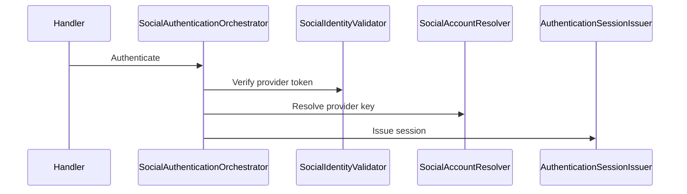
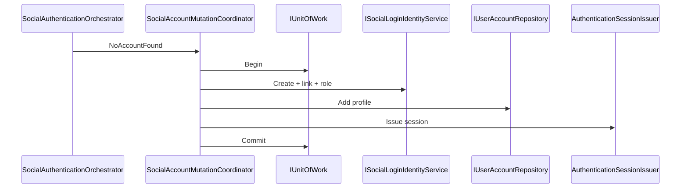
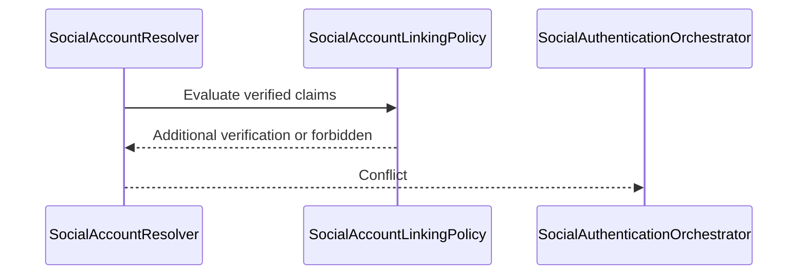
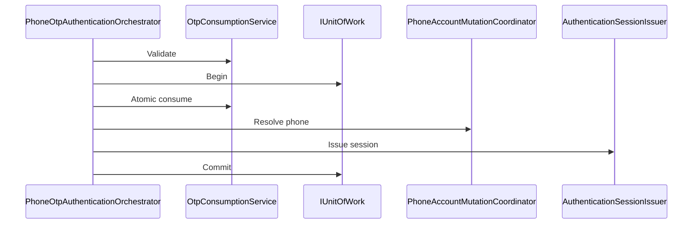
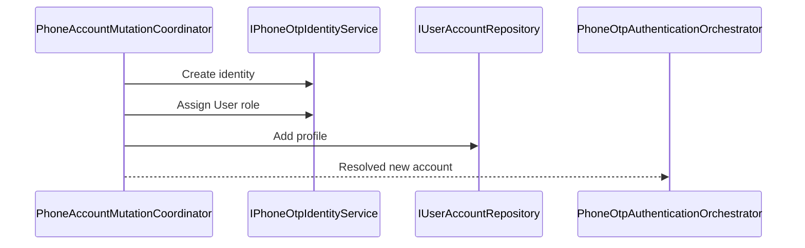
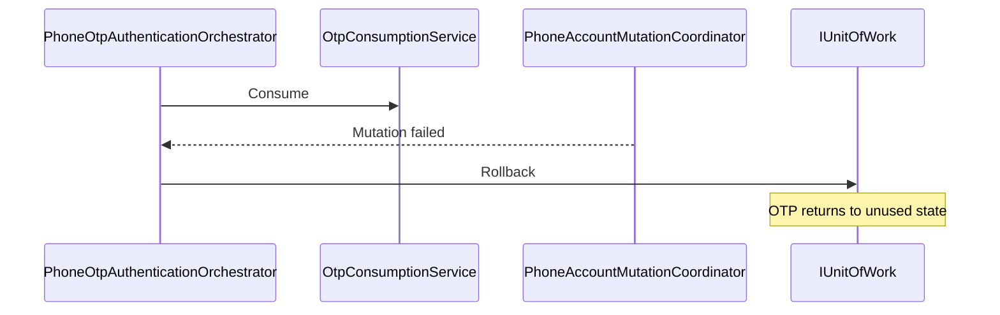
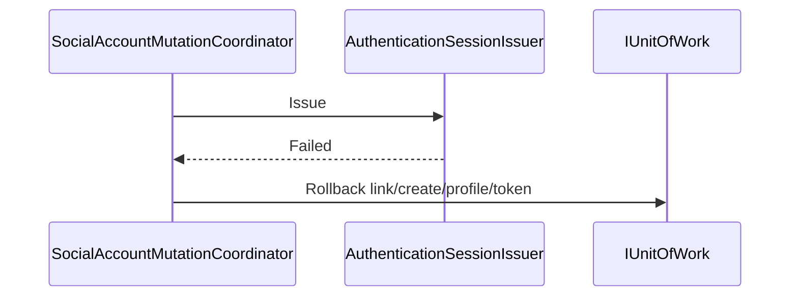

# Authentication orchestration

## Architecture

Command handlers perform only command-to-orchestrator delegation. Provider/OTP
validation, account resolution, pure policy, mutation, transaction coordination
and session issuance are separate. Application policies do not reference EF Core
or ASP.NET Identity. Infrastructure implements Identity mutations.

The canonical `IAuthenticationSessionIssuer` creates access and refresh tokens,
persists the hashed refresh token through `IRefreshTokenRepository`, records the
successful login and writes a bounded audit payload containing method, outcome
and timestamp only.

## Sequences

### Existing linked social account



### First-time social account



### Social conflict



### Existing phone OTP login



### New phone account



### OTP consumed then mutation failure



### Session issuance failure



### Concurrent social login

```mermaid
sequenceDiagram
  participant A as Request A
  participant DB as PostgreSQL constraints
  participant B as Request B
  A->>DB: Create/link provider subject
  B->>DB: Create/link same provider subject
  DB-->>A: One transaction succeeds
  DB-->>B: Unique conflict; no second link/account
```

## Error and retry rules

Expected failures use bounded response codes/messages; internal exceptions are
not returned. Before commit, all mutations roll back. A session persistence
failure rolls back account/link/OTP changes. Provider token validation is an
external read and occurs before opening the database transaction. Retrying the
same valid provider identity resolves the unique persisted link. OTP replay is
prevented by the atomic conditional consume operation.

## Security invariants

No raw token, OTP, phone, email, password or claims are placed in operational
logs or metric labels. Linking never trusts an unverified email. The same issuer
is used by password, social and phone OTP login. Refresh rotation and hashing
remain owned by `IRefreshTokenRepository`.
