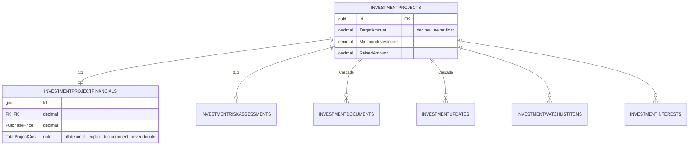

# PropertyApi — Entity Relationship Diagram (as-applied schema)

Generated 2026-09-04 from the actual `AppDbContext` model and migration set (verified live by
applying all 35 migrations to a disposable PostgreSQL 17/PostGIS 3.5 database — see
[../DATABASE-PRODUCTION-READINESS.md](../DATABASE-PRODUCTION-READINESS.md) §40-41). Only
entities that exist in the codebase today are shown; no proposed or future tables. No secret or
sensitive values are shown — field lists are limited to keys, cardinality-defining columns, and
the few fields each domain audit section names explicitly.

Split into two diagrams for readability: core platform (identity/listings/bookings/finance) and
the short-stay/investment subsystems, which connect to the core only through `Properties`/
`UserAccounts` conceptually and are otherwise self-contained.

## Core platform

```mermaid
erDiagram
    USERS ||--|| USERACCOUNTS : "shared PK, Restrict"
    USERACCOUNTS ||--o{ PROPERTIES : "Owner (Restrict)"
    USERACCOUNTS |o--o{ PROPERTIES : "Agent (SetNull)"
    USERS ||--o{ REFRESHTOKENS : "Cascade"
    USERS |o--o{ AUDITLOGS : "SetNull"
    GOVERNORATES ||--o{ DISTRICTS : "Restrict"
    DISTRICTS ||--o{ NEIGHBORHOODS : "Restrict"
    GOVERNORATES |o--o{ PROPERTIES : "Restrict"
    DISTRICTS |o--o{ PROPERTIES : "Restrict"
    NEIGHBORHOODS |o--o{ PROPERTIES : "Restrict"
    PROPERTYTYPES |o--o{ PROPERTIES : "Restrict"
    AGENCIES |o--o{ PROPERTIES : "SetNull (AgencyId)"
    AGENCIES |o--o{ USERACCOUNTS : "SetNull (membership)"
    PLANS |o--o{ USERACCOUNTS : "Restrict (PlanId)"
    PROPERTIES ||--o{ PROPERTYIMAGES : "Cascade"
    PROPERTIES ||--o{ PROPERTYAMENITIES : "Cascade"
    AMENITIES ||--o{ PROPERTYAMENITIES : "Cascade"
    PROPERTIES ||--o{ FAVORITES : "Cascade"
    USERACCOUNTS ||--o{ FAVORITES : "Cascade"
    PROPERTIES ||--o{ PROPERTYREVIEWS : "Cascade"
    USERACCOUNTS ||--o{ PROPERTYREVIEWS : "Restrict (Reviewer)"
    PROPERTIES ||--o{ VISITREQUESTS : "Restrict"
    USERACCOUNTS ||--o{ VISITREQUESTS : "Restrict (Requester)"
    PROPERTIES ||--o{ PROPERTYPRICEHISTORIES : ""
    USERACCOUNTS ||--o{ USERRATINGS : "Rater / Rated"
    PROPERTIES |o--o{ TRANSACTIONS : "Restrict"
    USERACCOUNTS |o--o{ TRANSACTIONS : "Restrict (Payer/Receiver)"
    VISITREQUESTS |o--o{ TRANSACTIONS : "SetNull (BookingId)"
    CURRENCIES ||--o{ PROPERTIES : "CurrencyCode (no FK, ISO code convention)"

    USERS {
        guid Id PK
        string Email UK "raw column, case-sensitive unique index"
        string NormalizedEmail "non-unique EmailIndex only - Finding F3"
        string PasswordHash "Identity hash, never plaintext"
        string NormalizedPhoneNumber UK "filtered unique, NULLs excluded"
        bool IsDeleted "global query filter"
        bool IsBanned
    }
    USERACCOUNTS {
        guid Id PK_FK "= Users.Id, shared PK"
        string FirstName
        string LastName
        guid AgencyId FK "nullable, SetNull"
        int PlanId FK "nullable, Restrict"
        string PlanStatus
        note "NO IsDeleted column - Finding F2"
    }
    PROPERTIES {
        guid Id PK
        guid OwnerId FK "UserAccounts, Restrict"
        guid AgentId FK "UserAccounts, nullable, SetNull"
        guid AgencyId FK "nullable, SetNull"
        int GovernorateId FK "nullable, Restrict"
        int DistrictId FK "nullable, Restrict"
        int NeighborhoodId FK "nullable, Restrict"
        int PropertyTypeId FK "nullable, Restrict"
        decimal ColdRent "decimal(18,4), nullable"
        decimal WarmRent "decimal(18,4), nullable"
        decimal PurchasePrice "decimal(18,4), nullable"
        string CurrencyCode "char(3), ISO 4217, default SYP"
        decimal Area "decimal(10,2), no CHECK - Finding F4"
        int Rooms "nullable, no CHECK - Finding F4"
        geography GeoLocation "GENERATED ALWAYS AS (...) STORED, Point 4326"
        string Status "enum-as-string, default Available"
        bool IsPublished
        bool IsDeleted "global query filter"
        uint xmin "optimistic concurrency token"
    }
    PROPERTYIMAGES {
        guid Id PK
        guid PropertyId FK
        string Url "CDN URL, no binary data"
        string PublicId "Cloudinary id"
        bool IsMain "unique per PropertyId where true"
    }
    PROPERTYREVIEWS {
        guid Id PK
        guid PropertyId FK
        guid ReviewerId FK
        int Rating "1-5, app-enforced only - Finding F4"
        note "unique (PropertyId, ReviewerId) - one review per user per property, DB-enforced"
    }
    VISITREQUESTS {
        guid Id PK
        guid PropertyId FK
        guid RequesterId FK
        string Status
        datetime ProposedAt
    }
    REFRESHTOKENS {
        guid Id PK
        guid UserId FK
        string TokenHash UK
        string ReplacedByTokenHash "rotation chain"
        bool IsRevoked
        datetime ExpiresAt
    }
    TRANSACTIONS {
        guid Id PK
        guid PropertyId FK "Restrict"
        guid PayerId FK "UserAccounts, Restrict"
        guid ReceiverId FK "UserAccounts, Restrict"
        guid BookingId FK "VisitRequests, nullable, SetNull"
        decimal Amount "decimal(18,2)"
        decimal AmountInUSD "decimal(18,2)"
        string Status "enum-as-string"
        uint xmin "optimistic concurrency token"
    }
    AUDITLOGS {
        guid Id PK
        guid UserId FK "nullable, SetNull"
        string Action
        text OldValue
        text NewValue
        datetime Timestamp
    }
    PLANS {
        int Id PK
        int ListingLimit "CHECK: NULL OR > 0 - the one app CHECK constraint in the schema"
    }
```

## Short-stay accommodation subsystem

```mermaid
erDiagram
    ACCOMMODATIONTYPES ||--o{ SHORTSTAYLISTINGS : "Restrict"
    SHORTSTAYLISTINGS ||--o{ ROOMTYPES : "Cascade"
    SHORTSTAYLISTINGS ||--o{ ACCOMMODATIONUNITS : "Cascade"
    SHORTSTAYLISTINGS ||--o{ SHORTSTAYLISTINGPHOTOS : "Cascade"
    SHORTSTAYLISTINGS ||--o{ SHORTSTAYLISTINGAMENITIES : "Cascade"
    SHORTSTAYLISTINGS ||--o{ PRICINGRULES : ""
    SHORTSTAYLISTINGS ||--o{ MINIMUMSTAYRULES : ""
    ACCOMMODATIONUNITS ||--o{ UNITBOOKINGRANGES : "EXCLUDE constraint - no overlap"
    SHORTSTAYLISTINGS ||--o{ SHORTSTAYREVIEWS : ""
    SHORTSTAYLISTINGS ||--o{ SHORTSTAYBOOKINGS : ""

    SHORTSTAYLISTINGS {
        guid Id PK
        string CurrencyCode "varchar(3), ISO 4217, NOT NULL, default SYP, fixed at creation; all prices are per night"
    }

    UNITBOOKINGRANGES {
        guid Id PK
        guid UnitId FK
        date CheckIn
        date CheckOut
        string Status
        note "EX_UnitBookingRanges_NoOverlap: EXCLUDE USING gist (UnitId WITH =, daterange(CheckIn,CheckOut,'[)') WITH &&) WHERE Status IN (Reserved, CheckedIn) - live-verified"
    }
```

## Investment discovery subsystem


