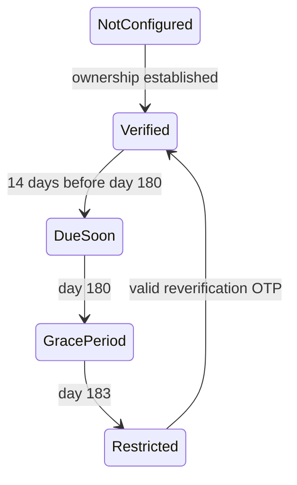

# Phone Password Authentication and Reverification

## Architecture

Phone authentication follows the existing API → MediatR → Application contract → Infrastructure adapter flow. ASP.NET Identity remains authoritative for password policy, hashing, lockout, password-reset tokens, roles, and security stamps. PostgreSQL stores both Identity data and `PhoneOtpChallenges`, so registration and OTP consumption use one database transaction.

Numbers are accepted only in canonical E.164 form and stored in `NormalizedPhoneNumber`. A filtered unique PostgreSQL index is the final concurrency guard. `PhoneNumber` remains protected by the existing data-protection converter; lookup diagnostics use no raw phone value.

## API

All paths are below `/api/auth/phone`.

| Method and path | Authorization | Rate policy | Purpose |
|---|---|---|---|
| `POST registration/send-otp` | Anonymous | `send-otp` | Generic registration challenge response |
| `POST registration/verify` | Anonymous | `verify-otp` | Consume challenge, create password account and session |
| `POST login` | Anonymous | `auth-login` | Phone and password login with Identity lockout |
| `POST password-reset/send-otp` | Anonymous | `auth-password-reset` | Generic reset challenge response |
| `POST password-reset/verify` | Anonymous | `verify-otp` | Exchange OTP for an Identity reset token |
| `POST password-reset/confirm` | Anonymous | `auth-password-reset` | Reset password and revoke sessions |
| `GET reverification/status` | Bearer | — | Current state and deadlines |
| `POST reverification/send-otp` | Bearer | `send-otp` | User-bound stored-phone challenge |
| `POST reverification/verify` | Bearer | `verify-otp` | Restore `Verified` state |
| `POST change/send-otp` | Bearer | `send-otp` | User-bound new-phone challenge |
| `POST change/verify` | Bearer + password | `verify-otp` | Change phone and revoke sessions |

Legacy `phone/send-otp` and `phone/verify` return HTTP 410. Email and social authentication are unchanged.

## OTP invariants

Challenges contain a random ID, normalized phone, purpose, optional authenticated user, HMAC/hash, five-minute expiry, attempt counter, consumption timestamp, and a two-minute reservation. Purpose, user, phone, expiry, attempt state, reservation, and consumption are checked before use. An atomic conditional update prevents concurrent reservation; final consumption is idempotent. Registration persists Identity, role, profile, refresh token, and consumption inside the same PostgreSQL transaction.

## Reverification state machine

The hourly batch worker processes 100 identities at a time. It creates persisted in-app reminders at 14, 7, and 1 days, grace start, one day before grace end, and restriction. A cycle/event key prevents duplicate user-facing notifications during retries. SMS is used for OTP delivery; the current notification subsystem has no general email or push reminder contract, so those channels are not invented here.

When `PhoneVerification:EnforcementEnabled` is true, restricted users may read data and access phone recovery, refresh, and logout endpoints, but other HTTP mutations receive `PHONE_REVERIFICATION_REQUIRED`.

## Sessions and security

Password reset and phone change update the Identity security stamp and revoke active refresh tokens. Existing refresh-token rotation, reuse detection, and JWT security-stamp validation remain authoritative. Unknown-phone login executes an Identity password-hasher dummy path and returns the same `PHONE_AUTH_FAILED` contract as a wrong password. Anonymous OTP send responses are generic.

Audit entries contain user ID when known, event name, outcome, IP through the existing audit redaction conventions, and no OTP, password, token, or raw phone.

## Migration and rollout

1. Deploy compatible code with enforcement and reminder processing disabled.
2. Run `scripts/report-phone-normalization-conflicts.sql` after application-level normalization backfill.
3. Resolve duplicates and invalid values manually; never merge accounts automatically.
4. Apply `AddPhonePasswordAuthenticationAndReverification`.
5. Enable reminder processing, observe one cycle, then enable enforcement per environment.

Existing users with no trustworthy phone-confirmation timestamp remain `NotConfigured` and are not restricted. Assign the documented 30-day transition during the operational backfill. Rollback first disables enforcement and jobs, then uses the migration `Down` operation. The migration drops only newly introduced schema on rollback.

## Error codes

`PHONE_ALREADY_REGISTERED`, `PHONE_AUTH_FAILED`, `PHONE_NUMBER_INVALID`, `PHONE_COUNTRY_NOT_SUPPORTED`, `PHONE_NUMBER_ALREADY_IN_USE`, `OTP_INVALID`, `PASSWORD_POLICY_FAILED`, `USER_CREATE_FAILED`, `ROLE_ASSIGNMENT_FAILED`, `PHONE_REVERIFICATION_REQUIRED`, `PHONE_REVERIFICATION_NOT_CONFIGURED`, `RECENT_AUTHENTICATION_REQUIRED`, and `PASSWORD_RESET_INVALID`.

## SMS configuration

### SMS providers

`SmsProvider:Provider` selects the adapter. **Twilio does not deliver to Syria** (its console lists Syria as "Not Available"), so a
deployment with Syrian users needs one of the providers below.

| `Provider` | Adapter | `ApiKey` is | `FromNumber` is | `ApiUrl` default |
|---|---|---|---|---|
| `D7` | D7 Networks (UAE), `POST /messages/v1/send`, Bearer token, Unicode text | the D7 API token | the originator (sender id), required | `https://api.d7networks.com/messages/v1/send` |
| `Unimatrix` | Unimatrix, `POST /?action=sms.message.send`, **always through a template** (`templateId` + `templateData.code`), success = HTTP 2xx and `{"code":"0"}` | the AccessKey ID (sent in the URL query, so this client has request logging removed) | the signature, optional (2–16 characters) | `https://api.unimtx.com/` |
| `Twilio` | Twilio SDK | not used: `Twilio:AccountSid`, `Twilio:AuthToken`, `Twilio:FromNumber` | not used | not used |
| anything else / `Http` | generic JSON POST `{to, from, message, apiKey}` | shared secret in the body | sender | required, HTTPS |

Only `Development`, `Testing` and `CI` use the console sink; every other environment uses the selected provider. In Production the
key, the sender (except Unimatrix) and an HTTPS URL are validated at startup; Twilio is no longer forced to fill in the HTTP provider's keys.

Syria specifics (from the providers' public pages, verify with the provider before launch): A2P traffic to Syria is restricted to OTP and
banking-type messages, marketing SMS is not allowed, the sender id may need registering, and the Syrian regulator (SYTRA) applies.

| Key | Default | Meaning |
|---|---|---|
| `SmsProvider:TimeoutSeconds` | 10 (clamped 1–60) | how long a send-OTP request waits for the HTTP provider before the send counts as failed (`SMS_FAILED`) |
| `SmsProvider:TemplateId` | empty | Unimatrix only: template code. Empty = the public Arabic OTP template `pub_otp_ar_security`, which needs no account verification. Free text to Syria was refused with `107141` (SmsTemplateNotExists) |
| `SmsProvider:AllowedCountryCodes` | empty (no restriction) | calling-code prefixes, for example `["+963", "+49"]`, a NEW registration or phone change may use; anything else is refused with `PHONE_COUNTRY_NOT_SUPPORTED` before any SMS is sent. Existing accounts (login, reset, re-verification) are never affected. **Set this in every deployed environment**: without it any number in the world can be sent a paid SMS, limited only by per-IP rate limits |

Auth responses are `Cache-Control: no-store`. The reminder worker repairs a verified user that has no due dates (verified + 180 days, grace +3 days) instead of failing the tick.

## Operational limitations

Data Protection keys must be shared across instances for Identity reset tokens. The reminder worker is database-idempotent but runs in every API instance; the deduplication key prevents duplicate notifications. Apply the conflict report before the unique index in databases containing legacy phone data.

## Known gaps (audit 2026-09-23)

See [docs/audit/phone-login-verification-2026-09-23.md](audit/phone-login-verification-2026-09-23.md). The audit findings are fixed; what remains is documented residual risk:

- Anti-enumeration: ineligible numbers receive a stored decoy challenge (same responses at verify time), but an eligible request also sends an SMS, so response time can differ, and `SMS_FAILED` is returned only for eligible numbers.
- A ban takes effect on existing access tokens within 5 minutes (security-stamp snapshot cache) unless the ban workflow invalidates `IUserSecurityStampCacheInvalidator`; no ban workflow exists yet.
- `PhoneNumber` is encrypted, but `NormalizedPhoneNumber` and `UserName` hold the E.164 number in plaintext (lookup column).
- The shared consent checkbox (`consent-checkbox`) shows hardcoded Arabic text on the phone register page in every language; it is legal copy and needs review before translation (audit F-14).
- `TwilioSmsService` has no explicit timeout and no test seam; the HTTP adapter does (audit F-23).
- No global SMS spend cap or alert exists; only per-IP and per-number limits plus the optional country list (audit F-15).
