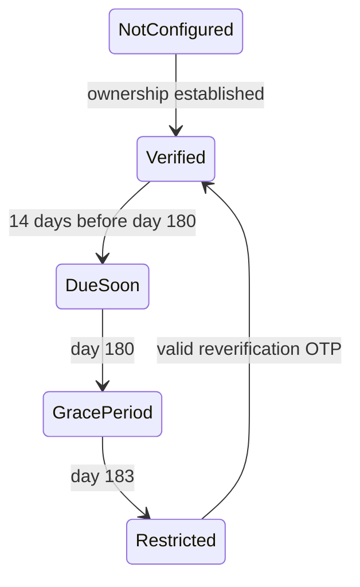

# Phone Password Authentication and Reverification

## Architecture

Phone authentication follows the existing API → MediatR → Application contract → Infrastructure adapter flow. ASP.NET Identity remains authoritative for password policy, hashing, lockout, password-reset tokens, roles, and security stamps. PostgreSQL stores both Identity data and `PhoneOtpChallenges`, so registration and OTP consumption use one database transaction.

Numbers are accepted only in canonical E.164 form and stored in `NormalizedPhoneNumber`. A filtered unique PostgreSQL index is the final concurrency guard. `PhoneNumber` remains protected by the existing data-protection converter; lookup diagnostics use no raw phone value.

## API

All paths are below `/api/auth/phone`.

| Method and path | Authorization | Rate policy | Purpose |
|---|---|---|---|
| `POST channels` | Anonymous | `public-read` | Which OTP channels (SMS, Telegram, WhatsApp) to offer for a number, see [OTP channels](#otp-channels) |
| `POST registration/send-otp` | Anonymous | `send-otp` | Generic registration challenge response |
| `POST registration/verify` | Anonymous | `verify-otp` | Consume challenge, create password account and session |
| `POST login` | Anonymous | `auth-login` | Phone and password login with Identity lockout |
| `POST password-reset/send-otp` | Anonymous | `auth-password-reset` | Generic reset challenge response |
| `POST password-reset/verify` | Anonymous | `verify-otp` | Exchange OTP for an Identity reset token |
| `POST password-reset/confirm` | Anonymous | `auth-password-reset` | Reset password and revoke sessions |
| `GET reverification/status` | Bearer | — | Current state and deadlines |
| `POST reverification/send-otp` | Bearer | `send-otp` | User-bound stored-phone challenge |
| `POST reverification/verify` | Bearer | `verify-otp` | Restore `Verified` state |
| `POST change/send-otp` | Bearer | `send-otp` | User-bound new-phone challenge |
| `POST change/verify` | Bearer + password | `verify-otp` | Change phone and revoke sessions |

Every `*/send-otp` accepts an optional `"channel"` (`Sms` | `Telegram` | `WhatsApp`, default `Sms`) and every verify endpoint accepts one too, see [OTP channels](#otp-channels).

Legacy `phone/send-otp` and `phone/verify` return HTTP 410. Email and social authentication are unchanged.

## OTP invariants

Challenges contain a random ID, normalized phone, purpose, optional authenticated user, HMAC/hash, five-minute expiry, attempt counter, consumption timestamp, and a two-minute reservation. Purpose, user, phone, expiry, attempt state, reservation, and consumption are checked before use. An atomic conditional update prevents concurrent reservation; final consumption is idempotent. Registration persists Identity, role, profile, refresh token, and consumption inside the same PostgreSQL transaction.

## Reverification state machine



The hourly batch worker reads only identities with something to do — inside the 14-day reminder window or past the due date, missing due dates, or a stored state that no longer matches the dates — and processes them 100 at a time by id (not by offset, which skipped users whose state the same tick corrected). The 180-day interval, 3-day grace period and 14-day window live in one place, `PhoneVerificationPolicy`. It creates persisted in-app reminders at 14, 7, and 1 days, grace start, one day before grace end, and restriction. A cycle/event key prevents duplicate user-facing notifications during retries. SMS is used for OTP delivery; the current notification subsystem has no general email or push reminder contract, so those channels are not invented here.

When `PhoneVerification:EnforcementEnabled` is true, restricted users may read data and access phone recovery, refresh, and logout endpoints, but other HTTP mutations receive `PHONE_REVERIFICATION_REQUIRED`.

## Sessions and security

Password reset and phone change update the Identity security stamp and revoke active refresh tokens. Existing refresh-token rotation, reuse detection, and JWT security-stamp validation remain authoritative. Unknown-phone login executes an Identity password-hasher dummy path and returns the same `PHONE_AUTH_FAILED` contract as a wrong password. Anonymous OTP send responses are generic.

Audit entries contain user ID when known, event name, outcome, IP through the existing audit redaction conventions, and no OTP, password, token, or raw phone.

## Migration and rollout

1. Deploy compatible code with enforcement and reminder processing disabled.
2. Run `scripts/report-phone-normalization-conflicts.sql` after application-level normalization backfill.
3. Resolve duplicates and invalid values manually; never merge accounts automatically.
4. Apply `AddPhonePasswordAuthenticationAndReverification`.
5. Enable reminder processing, observe one cycle, then enable enforcement per environment.

Existing users with no trustworthy phone-confirmation timestamp remain `NotConfigured` and are not restricted. Assign the documented 30-day transition during the operational backfill. Rollback first disables enforcement and jobs, then uses the migration `Down` operation. The migration drops only newly introduced schema on rollback.

## Error codes

`PHONE_ALREADY_REGISTERED`, `PHONE_AUTH_FAILED`, `PHONE_NUMBER_INVALID`, `PHONE_COUNTRY_NOT_SUPPORTED`, `PHONE_NUMBER_ALREADY_IN_USE`, `OTP_INVALID`, `PASSWORD_POLICY_FAILED`, `USER_CREATE_FAILED`, `ROLE_ASSIGNMENT_FAILED`, `PHONE_REVERIFICATION_REQUIRED`, `PHONE_REVERIFICATION_NOT_CONFIGURED`, `RECENT_AUTHENTICATION_REQUIRED`, `PASSWORD_RESET_INVALID`, and, for channels, `OTP_CHANNEL_UNAVAILABLE` and `OTP_PROVIDER_UNAVAILABLE` (`SMS_FAILED` stays the SMS-specific spelling of the latter).

## OTP channels

**Phone number = user identity. Channel = how one challenge's code is delivered.** Choosing another channel never creates another user; it creates another challenge for the same number.

### Architecture

```text
PhonePasswordAuthController ─► MediatR ─► PhoneAuthenticationWorkflow
                                                │
                                        IOtpChannelService  (OtpChannelService: availability, recommendation, dispatch)
                                                │
              ┌─────────────────────────────────┼─────────────────────────────────┐
        SmsOtpProvider                TelegramGatewayOtpProvider          WhatsAppCloudOtpProvider
   (wraps the existing ISmsService)   (Telegram Gateway API)              (WhatsApp Business Platform)
```

* `IOtpProvider` (`Application/Auth/Phone/OtpChannelContracts.cs`) is the seam. The workflow never branches on a channel; adding a provider is one class plus one registration in `AddOtpChannels` (`AuthInfrastructureRegistration`).
* `PhoneOtpChallenge` gained `Channel` (text, default `Sms`, so every existing row reads as SMS) and `ProviderRequestId` (the provider's id for the delivery, never the code). Migration `AddOtpChannelToPhoneOtpChallenges` is additive and reversible.
* Codes are still generated and stored by `OtpService` (HMAC-SHA256, 5 minutes, 3 attempts, single use); a provider only delivers the code it is given. Verification is local for every channel.
* A verify request may name a channel. If it does and it differs from the challenge's channel, the answer is the generic `OTP_INVALID` and no attempt is counted. A verify that names none is accepted for any channel (older clients).

### Channel availability

`POST /api/auth/phone/channels` with `{"phoneNumber": "+963..."}` (number optional) returns

```json
{ "channels": [
  { "channel": "Sms",      "available": true,  "recommended": false, "reason": null,                  "unavailableCountryCodes": [] },
  { "channel": "Telegram", "available": true,  "recommended": true,  "reason": null,                  "unavailableCountryCodes": [] },
  { "channel": "WhatsApp", "available": false, "recommended": false, "reason": "COUNTRY_NOT_SUPPORTED", "unavailableCountryCodes": ["+963", "+53", "+98", "+850"] } ] }
```

The answer depends on configuration and the public calling code only, never on whether the number has an account or a Telegram/WhatsApp profile, so it cannot be used to enumerate anything. `reason` is `CHANNEL_DISABLED` or `COUNTRY_NOT_SUPPORTED`. The app shows either "not available in your country" under the option, or the fixed list of countries from `unavailableCountryCodes`. Sending on an unavailable channel is refused with `OTP_CHANNEL_UNAVAILABLE` before any account lookup, so the refusal is identical for known and unknown numbers.

### Rate limits and anti-enumeration

* The limit is **per number and purpose, across all channels**: at most 3 real challenges per hour, whatever mix of SMS/Telegram/WhatsApp; past that every request is answered with the latest challenge and nothing is sent. The HTTP limiters (`send-otp` 3 per 15 min, `verify-otp` 5 per 15 min per client) are per client, not per channel.
* An ineligible number (for example a registration for a number that already has an account) gets a stored decoy challenge on the requested channel and nothing is sent, exactly as before.
* If the provider says the **recipient** cannot receive on that channel (not on Telegram, undeliverable on WhatsApp), that is a fact about the number, so the answer stays the generic success and the app offers "Didn't receive the code? Send via ...". Only a failure of the **provider** itself (credentials refused, timeout, 5xx, no balance) is reported, as `OTP_PROVIDER_UNAVAILABLE` (`SMS_FAILED` for SMS), and the challenge is discarded. That residual is the same one SMS already had (only eligible numbers reach a provider), see Known gaps.
* The fallback is user-initiated. Nothing is ever sent on two channels automatically.

### Configuration

| Key | Default | Meaning |
|---|---|---|
| `OtpChannels:Sms:Enabled` | `true` | switches SMS off |
| `OtpChannels:Telegram:Enabled` | `false` | switches Telegram on; needs `TelegramGateway:ApiToken` |
| `OtpChannels:WhatsApp:Enabled` | `false` | switches WhatsApp on; needs the `WhatsAppCloud:*` keys |
| `OtpChannels:<Channel>:UnavailableCountryCodes` | Telegram/SMS: none. WhatsApp: `["+963","+53","+98","+850"]` | calling-code prefixes where the channel is not offered. Setting it **replaces** the built-in list |
| `OtpChannels:DefaultRecommended` | empty | channel suggested when no country entry matches |
| `OtpChannels:RecommendedByCountryCode:<code>` | none | channel suggested for numbers starting with the calling code (longest prefix wins), for example `963` or `+963` = `Telegram`; write it without the plus in environment variables (`OtpChannels__RecommendedByCountryCode__963`). Only suggested when it is available |
| `TelegramGateway:ApiToken` | none | Gateway access token (secret, sent as a Bearer header) |
| `TelegramGateway:BaseUrl` / `TimeoutSeconds` / `SenderUsername` | `https://gatewayapi.telegram.org/` / 10 / empty | transport settings; the optional verified sender channel |
| `WhatsAppCloud:AccessToken` / `PhoneNumberId` / `TemplateName` | none | Graph API token (secret), sending number id, approved AUTHENTICATION template |
| `WhatsAppCloud:TemplateLanguage` / `ApiVersion` / `BaseUrl` / `TimeoutSeconds` | `ar` / `v21.0` / `https://graph.facebook.com/` / 10 | transport settings |

Environment-variable form: `OtpChannels__Telegram__Enabled=true`, `TelegramGateway__ApiToken=...`. Secrets go in the platform's secret store or user-secrets, never in Git. A deployment with no Telegram/WhatsApp keys starts and behaves exactly as before; enabling a channel without its credentials makes **Production** refuse to start (validated at startup). In Development, Testing and CI an enabled channel uses a console stand-in that prints the code (like `ConsoleSmsService`); with Staging test support on, Telegram and WhatsApp are never registered, so the smoke suite cannot reach a real account. **To disable a provider without a deployment**, set its `Enabled` to `false` in the environment and restart/redeploy config; the picker then shows it as unavailable.

### Telegram Gateway

Official API only (`https://core.telegram.org/gateway/api`). Our own code is sent with `sendVerificationMessage` (`phone_number`, `code`, `ttl`=300, optional `sender_username`), authenticated with `Authorization: Bearer <token>`. Setup: create a Gateway account, take the access token, set `OtpChannels:Telegram:Enabled=true` and `TelegramGateway:ApiToken`. Sending to the account's own phone is free, which is how to run the first real test.

Deliberate omissions: `checkSendAbility` (billed, and it would reveal whether a number has Telegram), `checkVerificationStatus` (verification is local), and the delivery-report callback (optional, would add an inbound endpoint that needs the `X-Request-Timestamp` / `X-Request-Signature` HMAC check; add it together with its tests if delivery tracking is wanted). Telegram publishes no error catalogue: an `ok:false` whose `error` starts with `PHONE_NUMBER_` or `USER_` is treated as an unreachable recipient, everything else as a provider failure. **Both classifications, and Syrian coverage, are unverified until a real account test.**

### WhatsApp Business Platform

Official Cloud API only, an approved AUTHENTICATION template carrying the code (`POST /{phone-number-id}/messages`). **Meta does not allow the Business Platform to deliver to Syria, Cuba, Iran, North Korea or the sanctioned regions of Ukraine**, which is why those calling codes are unavailable for this channel by default (do not remove them). No unofficial WhatsApp automation is used or acceptable. The adapter is **not verified against a real Meta account**; it is off by default.

### Monitoring

Structured logs (masked number, never the code, token or provider payload): challenge created, provider selected, send succeeded/failed with outcome, rate limited. Metrics on the `HudhudNestApi.Application` meter: `auth.otp.send` (`channel`, `outcome` = `sent` | `unreachable` | `provider_unavailable` | `channel_unavailable` | `rate_limited`) and `auth.otp.verification` (`channel`, `outcome` = `succeeded` | `failed`). No phone number and no country label (a country label would be an unbounded tag set; the channel and outcome sets are fixed).

### Provider availability

| Country / region | SMS | Telegram | WhatsApp | Verified |
|---|---|---|---|---|
| Syria (+963) | Twilio: not available; Unimatrix/D7: accepted by the provider, **delivery to a real Syrian phone not confirmed** | UNKNOWN / NOT VERIFIED | Not offered (Meta does not deliver to Syria) | No |
| Germany (+49) | Twilio: delivered (real test 2026-09-23, +49 number) | UNKNOWN / NOT VERIFIED (self-test needs the Gateway token) | UNKNOWN / NOT VERIFIED (needs a Meta account and template) | SMS only |
| Cuba, Iran, North Korea | not assessed | UNKNOWN / NOT VERIFIED | Not offered (Meta) | No |

### Adding a provider later

Implement `IOtpProvider` (return `Sent`, `RecipientUnreachable` or `ProviderUnavailable`, never throw, never log the code or the credential), add the member to `OtpChannel` (at the end), an `OtpChannelOptions` entry, a `For`/`DisplayOrder` line in the options and service, register it in `AddOtpChannels` behind its `Enabled` flag with startup validation, then add the frontend option and translations.

## SMS configuration

### SMS providers

`SmsProvider:Provider` selects the adapter. **Twilio does not deliver to Syria** (its console lists Syria as "Not Available"), so a
deployment with Syrian users needs one of the providers below.

| `Provider` | Adapter | `ApiKey` is | `FromNumber` is | `ApiUrl` default |
|---|---|---|---|---|
| `D7` | D7 Networks (UAE), `POST /messages/v1/send`, Bearer token, Unicode text | the D7 API token | the originator (sender id), required | `https://api.d7networks.com/messages/v1/send` |
| `Unimatrix` | Unimatrix, `POST /?action=sms.message.send`, **always through a template** (`templateId` + `templateData.code`), success = HTTP 2xx and `{"code":"0"}` | the AccessKey ID (sent in the URL query, so this client has request logging removed) | the signature, optional (2–16 characters) | `https://api.unimtx.com/` |
| `Twilio` | Twilio SDK | not used: `Twilio:AccountSid`, `Twilio:AuthToken`, `Twilio:FromNumber` | not used | not used |
| anything else / `Http` | generic JSON POST `{to, from, message, apiKey}` | shared secret in the body | sender | required, HTTPS |

Only `Development`, `Testing` and `CI` use the console sink; every other environment uses the selected provider. In Production the
key, the sender (except Unimatrix) and an HTTPS URL are validated at startup; Twilio is no longer forced to fill in the HTTP provider's keys.

Syria specifics (from the providers' public pages, verify with the provider before launch): A2P traffic to Syria is restricted to OTP and
banking-type messages, marketing SMS is not allowed, the sender id may need registering, and the Syrian regulator (SYTRA) applies.

| Key | Default | Meaning |
|---|---|---|
| `SmsProvider:TimeoutSeconds` | 10 (clamped 1–60) | how long a send-OTP request waits for the HTTP provider before the send counts as failed (`SMS_FAILED`) |
| `SmsProvider:TemplateId` | empty | Unimatrix only: template code. Empty = the public Arabic OTP template `pub_otp_ar_security`, which needs no account verification. Free text to Syria was refused with `107141` (SmsTemplateNotExists) |
| `SmsProvider:AllowedCountryCodes` | empty (no restriction) | calling-code prefixes, for example `["+963", "+49"]`, a NEW registration or phone change may use; anything else is refused with `PHONE_COUNTRY_NOT_SUPPORTED` before any SMS is sent. Existing accounts (login, reset, re-verification) are never affected. **Set this in every deployed environment**: without it any number in the world can be sent a paid SMS, limited only by per-IP rate limits |

Auth responses are `Cache-Control: no-store`. The reminder worker repairs a verified user that has no due dates (verified + 180 days, grace +3 days) instead of failing the tick.

## Operational limitations

Data Protection keys must be shared across instances for Identity reset tokens. The reminder worker is database-idempotent but runs in every API instance; the deduplication key prevents duplicate notifications. Apply the conflict report before the unique index in databases containing legacy phone data.

## Known gaps (audit 2026-09-23)

See [docs/audit/phone-login-verification-2026-09-23.md](audit/phone-login-verification-2026-09-23.md). The audit findings are fixed; what remains is documented residual risk:

- Anti-enumeration: ineligible numbers receive a stored decoy challenge (same responses at verify time), but an eligible request also sends an SMS, so response time can differ, and `SMS_FAILED` is returned only for eligible numbers.
- A ban takes effect on existing access tokens within 5 minutes (security-stamp snapshot cache) unless the ban workflow invalidates `IUserSecurityStampCacheInvalidator`; no ban workflow exists yet.
- `PhoneNumber` is encrypted, but `NormalizedPhoneNumber` and `UserName` hold the E.164 number in plaintext (lookup column).
- The shared consent checkbox (`consent-checkbox`) shows hardcoded Arabic text on the phone register page in every language; it is legal copy and needs review before translation (audit F-14).
- `TwilioSmsService` has no explicit timeout and no test seam; the HTTP adapter does (audit F-23).
- No global SMS spend cap or alert exists; only per-IP and per-number limits plus the optional country list (audit F-15).
