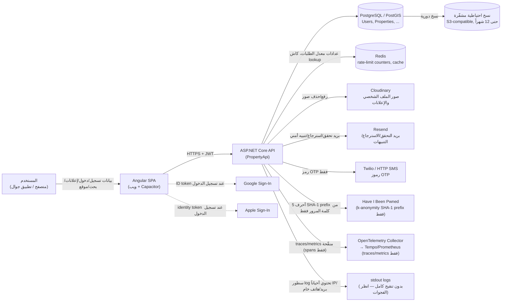

# تتبّع دورة حياة البيانات (Data Flow) — PropertyApi / Wohnungsmieten

**الإصدار:** 0.1 (مسودة) | **التاريخ:** 2026-09-04 | مرتبط بـ [`data-inventory.md`](./data-inventory.md)

هذا الملف يتتبع دورة حياة كل فئة بيانات رئيسية عبر 19 سؤالاً محدداً، بالاعتماد على تدقيق فعلي للكود. الحالات المعلّمة ❓ تحتاج تأكيداً إضافياً.

## مخطط التدفق العام

---

## 1. البريد الإلكتروني وكلمة المرور

| السؤال | الإجابة | حالة التحقق |
|---|---|---|
| أين يبدأ جمعها؟ | نموذج التسجيل (`POST /api/auth/register`) | ✅ |
| قبل تسجيل الدخول أم بعده؟ | قبل (هذا ما يُنشئ الحساب) | ✅ |
| هل تُرسل عبر HTTPS؟ | نعم في Staging/Production (behind TLS termination)؛ محلياً HTTP على localhost فقط | ✅ (إنتاج) / 🧩 (محلي، متوقع وغير خطير) |
| أين تمر داخل التطبيق؟ | `AuthController` → `RegisterCommandHandler` → ASP.NET Identity → PostgreSQL | ✅ |
| هل تُخزَّن مؤقتاً؟ | البريد: لا كاش. كلمة المرور: لا تُخزَّن كنص أبداً، فقط hash فوري | ✅ |
| هل تدخل Logs؟ | **البريد: نعم**، في عدة مواضع (`RegisterCommand.cs:185-190`, `ForgotPasswordCommand.cs:133-135`, `AddEmailCommand.cs:136-139`, `ResendConfirmationEmailCommand.cs:72-74`) | ✅ **فجوة مؤكدة** |
| هل تُرسل لخدمة خارجية؟ | البريد: نعم لـ Resend (لتوصيل رسائل التحقق/الاسترجاع). كلمة المرور: لا (فقط SHA-1 prefix جزئي لـ HIBP) | ✅ |
| أين تُخزَّن؟ | `Users.Email` (نص صريح)، `Users.PasswordHash` (hash) | ✅ |
| من يصل إليها؟ | الخادم (كامل الوصول)، لا يوجد endpoint يُرجع بريد مستخدم آخر لغير الأدمن | ✅ |
| متى تُعدَّل؟ | عبر `PUT /api/Users/me`، `POST /api/auth/add-email` | ✅ |
| متى تُحذف؟ | ✅ **مُحدَّث 2026-09-05**: عند حذف الحساب (`DELETE /api/Users/me`) يُستبدَل البريد فعلياً بقيمة غير قابلة للربط (`deleted-{id}@deleted.invalid`، `IdentityCredentialService.AnonymizeCredentialsAsync`). ميزة نُفِّذت بالتوازي مع هذه المهمة — انظر `privacy-gaps.md` P0-1 | ✅ مُصلَحة (خارج نطاق هذه المهمة) |
| تبقى في النسخ الاحتياطية؟ | نعم، حتى 12 شهراً وفق سياسة الطبقات الحالية — بما فيها نسخة أُخذت **قبل** طلب الحذف (تحوي القيمة الأصلية قبل الاستبدال) | ✅ |
| Anonymize/pseudonymize؟ | ✅ **نعم الآن** — البريد يُستبدَل، الاسم يُستبدَل بـ"Deleted User"، الصورة/النبذة/معلومات التواصل تُمسَح (`UserAccount.Anonymize`) | ✅ مُصلَحة |
| هل يمكن للمستخدم طلب نسخة؟ | ❓ لا يوجد endpoint تصدير بيانات (`data export`) — لم يُعثر عليه في الكود | ✅ (غياب مؤكد)، فجوة P1-9 |
| تصحيح/حذف؟ | تصحيح: نعم (`PUT /api/Users/me`). حذف/محو: نعم الآن (anonymization حقيقي) | ✅ |
| تستمر المعالجة بعد إلغاء الحساب؟ | لا — الحقول الشخصية الأساسية تُمحى؛ تبقى فقط سجلات تدقيق أمنية (`AuditLogs`) بلا مدة احتفاظ محددة بعد (آلية جاهزة معطَّلة، P1-2) | جزئي — الفجوة الآن في `AuditLogs` فقط، لا في بيانات الحساب نفسها |
| احتفاظ لالتزام قانوني/أمني؟ | ❓ غير موثق — لا يوجد نص صريح يربط الاحتفاظ بالتزام قانوني محدد | يحتاج تأكيد |
| تنتقل لدولة/منطقة أخرى؟ | Resend (لإرسال البريد) وCloudinary وRender: ❓ **مواقع مراكز البيانات الفعلية لهذه الخدمات لم تُؤكَّد ضمن هذا التدقيق** — يحتاج تأكيداً من المالك (اتفاقيات معالجة البيانات DPA مع كل مزوّد) | يحتاج تأكيد |
| تُستخدم لغرض مختلف عن الأصلي؟ | لا دليل على ذلك في الكود المفحوص | ✅ (لم يُعثر على استخدام ثانوي) |

## 2. رقم الهاتف ورموز OTP

| السؤال | الإجابة | حالة التحقق |
|---|---|---|
| أين يبدأ جمعها؟ | `POST /api/auth/phone/registration/send-otp` | ✅ |
| قبل الدخول أم بعده؟ | قبل | ✅ |
| HTTPS؟ | نعم (إنتاج) | ✅ |
| أين تمر؟ | `PhonePasswordAuthController` → `PhoneAuthenticationWorkflow` → Twilio/HTTP SMS (لإرسال الرمز) → PostgreSQL (`PhoneOtpChallenges`, `Users`) | ✅ |
| تُخزَّن مؤقتاً؟ | الرمز: 5 دقائق فقط كـ hash. الرقم: دائم | ✅ |
| تدخل Logs؟ | ✅ **مُصلَح 2026-09-05**: كان وضع التطوير (`ConsoleSmsService`) يسجّل الرقم والرمز الخام معاً (`ConsoleSmsService.cs:32-37`) — **مؤكد أنه غير قابل للوصول في Staging/Production** أصلاً. الرقم الآن يُخفى جزئياً (`PiiMasking.MaskPhone`) حتى في هذا المسار التطويري؛ الرمز يبقى ظاهراً عمداً (هذا هو الغرض من الكلاس). مسارات الإنتاج (Twilio/HTTP): الرقم يُخفى الآن جزئياً عند التسجيل، وليس الرمز أصلاً | ✅ مُصلَحة |
| تُرسل لخدمة خارجية؟ | نعم Twilio/مزوّد HTTP SMS محلي — الرمز فقط ضمن نص الرسالة، والرقم كمستلم | ✅ |
| أين تُخزَّن؟ | `Users.PhoneNumber` (مشفّر)، `Users.NormalizedPhoneNumber` (نص صريح!)، `Users.PhoneNumberLookupHash` (HMAC)، `PhoneOtpChallenges.CodeHash` | ✅ |
| من يصل إليها؟ | الخادم؛ لا endpoint يُرجع رقم هاتف مستخدم آخر إلا إن كان "Agent" (`GetUserByIdQueryHandler.cs:81-84`) | ✅ |
| تُعدَّل؟ | عبر مسار "تغيير رقم الهاتف" المخصص (يتطلب OTP جديد) | ✅ |
| تُحذف؟ | ✅ **مُحدَّث 2026-09-05**: عند حذف الحساب، الحقول الثلاثة (`PhoneNumber`, `NormalizedPhoneNumber`, `PhoneNumberLookupHash`) تُمسَح جميعها (`IdentityCredentialService.cs:201-203`). ميزة نُفِّذت بالتوازي مع هذه المهمة | ✅ مُصلَحة (خارج نطاق هذه المهمة) |
| نسخ احتياطية؟ | نعم، بما فيها نسخة أُخذت قبل الحذف تحوي القيمة الأصلية | ✅ |
| Anonymize؟ | ✅ نعم الآن — تُمسَح تماماً (ليست استبدالاً بقيمة عشوائية، بل `null`) | ✅ مُصلَحة |
| نسخة/تصحيح/حذف من المستخدم؟ | تصحيح: نعم (بإعادة تحقق). تصدير: لا (فجوة P1-9). حذف فعلي: نعم الآن | جزئي |
| معالجة بعد إلغاء الحساب؟ | لا — تُمسَح بالكامل عند الحذف | ✅ مُصلَحة |
| نقل دولي؟ | Twilio (شركة أمريكية) — ❓ يحتاج تأكيد اتفاقية DPA ومكان معالجة البيانات الفعلي | يحتاج تأكيد |

## 3. صور الملف الشخصي وصور الإعلانات (Cloudinary)

| السؤال | الإجابة | حالة التحقق |
|---|---|---|
| أين يبدأ جمعها؟ | رفع اختياري عبر `POST /api/Users/me/avatar` أو `POST` رفع صور الإعلان | ✅ |
| قبل الدخول أم بعده؟ | بعده (يتطلب مصادقة) | ✅ |
| HTTPS؟ | نعم | ✅ |
| أين تمر؟ | Controller → Command Handler → `CloudinaryMediaStorageService` → Cloudinary API | ✅ |
| تُخزَّن مؤقتاً؟ | فقط أثناء الرفع (stream)، لا تخزين وسيط على الخادم | ✅ |
| تدخل Logs؟ | لا (لم يُعثر على أي تسجيل لمحتوى الصورة أو بياناتها الوصفية) | ✅ (غياب مؤكد) |
| تُرسل لخدمة خارجية؟ | نعم، Cloudinary (رفع، وتوصيل CDN لاحقاً) | ✅ |
| أين تُخزَّن؟ | Cloudinary (الملف الثنائي) + PostgreSQL (`Url`, `PublicId` فقط كمرجع) | ✅ |
| من يصل إليها؟ | **أي شخص يملك الرابط** — الروابط عامة غير موقّعة (`type=upload` افتراضي) | ✅ **يستحق إفصاحاً واضحاً في السياسة** |
| تُعدَّل؟ | نعم، عبر استبدال الصورة (يُحذف القديم من Cloudinary تلقائياً لصور الملف الشخصي فقط) | ✅ |
| تُحذف؟ | صورة الملف الشخصي: نعم عند الاستبدال أو حذف صريح **أو حذف الحساب** (أُضيف الآن ضمن `DeleteUserCommandHandler`، خارج نطاق هذه المهمة). صور الإعلان: ✅ **مُصلَح ضمن هذه المهمة** — تُحذف الآن من Cloudinary عند حذف الإعلان يدوياً (`DeletePropertyCommandHandler`) وعند انتهائه تلقائياً بعد فترة السماح (`ListingExpiryHostedService.DeleteAfterGraceAsync`)، بأسلوب best-effort لا يُفشل العملية الأساسية | ✅ مُصلَحة |
| نسخ احتياطية؟ | Cloudinary لديها نسخها الاحتياطية الخاصة بها (خارج نطاق هذا المستودع) — ❓ يحتاج تأكيداً من إعدادات حساب Cloudinary | يحتاج تأكيد |
| Anonymize؟ | غير منطبق (لا PII مباشر داخل الصورة نفسها من الكود، لكن **بيانات EXIF المحتملة لم تُفحص/تُزَل صراحة** — Cloudinary الافتراضي هو ما يُطبَّق، لم يُتحقق منه من هذا الكود) | ❓ يحتاج تأكيد (إعدادات حساب Cloudinary) |
| نقل دولي؟ | Cloudinary — ❓ مركز البيانات الفعلي يحتاج تأكيداً من لوحة تحكم الحساب | يحتاج تأكيد |

## 4. عنوان IP وسجلات الدخول

| السؤال | الإجابة | حالة التحقق |
|---|---|---|
| أين يبدأ جمعها؟ | كل طلب HTTP، عبر `ForwardedHeaders` middleware | ✅ |
| قبل الدخول أم بعده؟ | قبل (كل طلب، مسجَّل أم لا) | ✅ |
| HTTPS؟ | العنوان نفسه ليس بيانات مرسلة من العميل، بل مُستخرج من الاتصال | غير منطبق |
| أين تمر؟ | Middleware → Controllers/Handlers → `AuditLogs`/`RefreshTokens` (DB) + `_logger` (stdout) + مفاتيح Redis لتحديد المعدل | ✅ |
| تُخزَّن مؤقتاً؟ | نعم في مفاتيح Redis لتحديد المعدل (تنتهي صلاحيتها تلقائياً خلال نافذة الحد) | ✅ |
| تدخل Logs؟ | ✅ **مُصلَح 2026-09-05** — كان يُسجَّل صراحة وبدون تنقيح في عدة مواضع (`AuthController.cs`, `SecurityAlertEmailService.cs`, `RedisRateLimitingMiddleware.cs` وغيرها)، أُضيفت دالة `PiiMasking.MaskIp`/`MaskIpsInText` وطُبِّقت على كل موضع (يُخفي آخر جزء من IPv4، آخر مجموعتين من IPv6) | ✅ مُصلَحة |
| تُرسل لخدمة خارجية؟ | نعم — مُضمَّن داخل نص بريد "تنبيه أمني" عبر Resend (`SecurityAlertEmailService.cs`) — **هذا سلوك مقصود وصحيح**: يُرسَل فقط لصاحب الحساب نفسه ليعرف من حاول الدخول، وليس تسريباً لطرف ثالث | ✅ لا يحتاج إصلاحاً (مُراجَع ومقصود) |
| أين تُخزَّن؟ | `RefreshTokens.CreatedByIp/RevokedByIp`, `AuditLogs.IpAddress` | ✅ |
| من يصل إليها؟ | الخادم فقط؛ لا يظهر في أي DTO يُعاد للعميل | ✅ |
| تُعدَّل؟ | لا (بيانات تسجيل تاريخية) | غير منطبق |
| تُحذف؟ | `RefreshTokens`: تنتهي/تُحذف مع دورة حياة التوكن، وتُبطَل جميعها عند حذف الحساب. `AuditLogs`: ⚙️ **آلية حذف/أرشفة أُضيفت الآن** (`AuditLogRetentionHostedService`) لكنها **معطَّلة افتراضياً** حتى يحدِّد المالك مدة احتفاظ صريحة (`AuditLogRetention:Enabled`/`RetentionDays`) — لا حذف فعلي يحدث بدون قرار صريح | جزئي — الآلية جاهزة، القرار معلَّق (P1-2) |
| نسخ احتياطية؟ | نعم | ✅ |
| نقل دولي؟ | غير مباشر (يظهر فقط داخل بريد Resend) | ✅ |

## 5. الموقع الجغرافي (بحث "بالقرب مني")

انظر الصف 11 في `data-inventory.md`. الخلاصة: لا تُخزَّن دائماً. ✅ **مُصلَح 2026-09-05**: كانت تُكتب كاملة في سجلات الخادم عند فشل الاستعلام (`PropertyGeoSearchRepository.cs:212-220`) — الآن تُقرَّب لأقرب رقم عشري واحد (~11 كم) بدل الإحداثيات الدقيقة، فيبقى التشخيص التقني ممكناً دون كشف موقع سكن دقيق.

## 6. بيانات الإعلانات العقارية (بما فيها العنوان والموقع)

انظر الصفوف 8-10 في `data-inventory.md`. هذه بيانات **يقصد صاحبها نشرها علناً** كجزء أساسي من الخدمة (سوق عقاري)، وبالتالي الأساس القانوني الأنسب هو تنفيذ العقد + موافقة ضمنية بالنشر. **الفجوة الوحيدة الحقيقية هنا ليست في النشر نفسه بل في عدم وجود آلية لحذف الصور المرفقة عند حذف/انتهاء الإعلان (راجع القسم 3 أعلاه).**

## 7. التسجيل الاجتماعي (Google / Apple)

| السؤال | الإجابة | حالة التحقق |
|---|---|---|
| أين يبدأ جمعها؟ | ضغطة "تسجيل عبر Google/Apple" في الواجهة | ✅ |
| قبل الدخول أم بعده؟ | قبل (ينشئ حساباً إن لم يكن موجوداً) | ✅ |
| أين تمر؟ | Angular → Google/Apple SDK (native أو web) → Backend (`POST /auth/social/google`\|`apple`) → `GoogleTokenVerifier`/Apple token verification → `SocialAccountMutationCoordinator` → PostgreSQL | ✅ |
| تدخل Logs؟ | لا — فشل التحقق يُسجَّل برسالة عامة فقط، بدون التوكن الخام | ✅ |
| تُرسل لخدمة خارجية؟ | نعم لـ Google/Apple كجزء من بروتوكول OAuth القياسي (اتجاه الطلب الأساسي، وليس "إرسال بيانات إضافية" من التطبيق إليهما) | ✅ |
| أين تُخزَّن؟ | `Users` (Email, Names, AvatarUrl)، `UserLogins` (Provider + ProviderId) | ✅ |
| ملاحظة تشغيلية مهمة | **تسجيل الدخول الأصلي (native) عبر Google/Apple موصول فعلياً في مشروع Android لكن غير مُزامَن حالياً مع مشروع iOS الأصلي** على الفرع المفحوص (`Package.swift` لم يُحدَّث بعد إضافة الإضافات) — يعني عملياً أن مسار iOS الأصلي لهذه الميزة غير قابل للتنفيذ حتى تتم إعادة `cap sync ios` | ✅ تم التحقق (Agent E) — ملاحظة تقنية للمطور، ذات صلة بدقة إفصاحات App Store لاحقاً |

---

## ملخص الفجوات الظاهرة من تتبع دورة الحياة (تُفصَّل بالكامل مع الأولويات في `privacy-gaps.md`)

**تحديث 2026-09-05 — الحالة الحالية لكل بند:**

1. ✅ **مُصلَح** (بالتوازي مع هذه المهمة، ليس ضمنها): مسار محو/anonymization حقيقي أُضيف لحذف الحساب — راجع `privacy-gaps.md` P0-1.
2. ❌ **لم يُصلَح** — لا تزال لا توجد آلية لحذف بيانات مستخدم من نسخة احتياطية سابقة للحذف (النسخ الاحتياطية opaque مشفَّرة بالكامل، لا مسار انتقائي). يحتاج قراراً هندسياً/تشغيلياً مستقلاً.
3. ✅ **مُصلَح ضمن هذه المهمة** — `PiiMasking` مُطبَّق على كل موضع معروف (~9 ملفات).
4. ✅ **مُصلَح ضمن هذه المهمة** — حذف Cloudinary عند حذف/انتهاء الإعلان.
5. ✅ **مُصلَح ضمن هذه المهمة** — الإحداثيات تُقرَّب في اللوغ بدل الدقة الكاملة.
6. ❌ **لا يزال يحتاج تأكيداً من المالك** — مواقع مراكز بيانات Cloudinary/Resend/Twilio/Render لم تُؤكَّد (خارج نطاق ما يمكن التحقق منه من الكود وحده).
7. ❌ **جديد، لم يُصلَح**: لا ميزة تصدير بيانات (Data Export/Portability) لأي مستخدم — فجوة P1-9.
8. ⚙️ **جديد، آلية جاهزة معطَّلة**: لا مدة احتفاظ محددة لسجلات `AuditLogs` — أُضيفت آلية حذف مُهيَّأة تتطلب قرار المالك لتفعيلها (P1-2).
